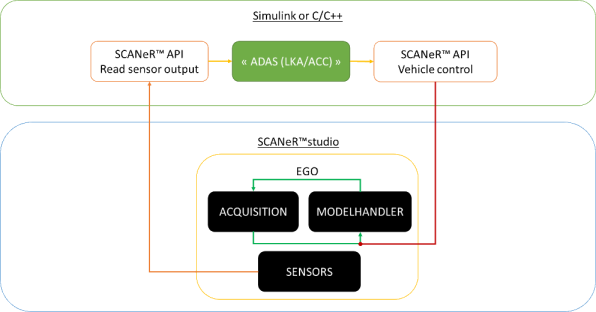

# How to? evaluate and validate an ADAS system

This guide explains how to design an experimentation to evaluate and validate an ADAS system with SCANeR studio.

This tutorial requires the [Foundation](https://www.avsimulation.com/pack-foundation/) and [AD/ADAS](https://www.avsimulation.com/pack-ad-adas/) packs. If you don't have them already, [get your Trial version of SCANeR](../HT_Download_Trial_SCANeR/HT_Install_Trial_SCANeR.md) and follow this walk-through.

# Principle

SCANeR studio hosts the model of vehicle, sensors and the interfaces that allow to connect your ADAS model.

The *SCANeR API* is the interface. It allows to read the vehicle status, driver inputs and sensors outputs.



For the current tutorial, we are going to focus on a simple *Automated Emergency Braking* (AEB).
The brakes should be activated when a pedetrian is detected too close ahead of the host vehicle.

We will need
* Step 1. A sensor model
* Step 3. A scenario with Ego car and pedestrian
* Step 2. The ADAS model

Before starting, [create a dedicated workspace](HT_Create_custom_work_environment/HT_Create_A_New_Workspace.md) called `TUTO_ADAS` for instance.

## Step 1. Sensor

### Functional sensor model

In this step, we will use the `radar` sensor functional model (L1).

> **Note:** SCANeR functional models are part of [AD/ADAS Pack](https://www.avsimulation.com/pack-ad-adas/). They use simulation logical content and 3D world model to determine a sensor's outputs. These are perfect models returning perfect targets' list. You can add noise to simulate signal perturbation. SCANeR functional models are made for you if you want to focus on the ADAS system himself or simulate without effort any of the 6 Levels of Vehicle Autonomy.

> If you want to focus on sensor processing check our [Physics Based Sensors Pack](https://www.avsimulation.com/pack-physics-based-sensors/).
")

SCANeR comes with a set of example sensor models to help you to begin.
To view and edit existing sensor models go to `RESOURCES panel` > `Sensors tab`.

We will use `LongRangeRadarSensor` as a template for our sensor model.

* Right click on `LongRangeRadarSensor` and select `Edit as new...`. The `Save sensor as...` GUI appears
* Save your new radar model as `LRRS1` (xml format). The `Sensor model edition` GUI appears
  > **Note:** We advise to use the same sensor model name as the market name, so you will find it easily later on.

This dialog enables to control any sensor's parameters as beam (e.g. quantity, shape, range, etc.).
Let's add `Predestrian` mobile obstacle to detection capatibilities.

* Click on `Edit Targets`, check `Predestrian` and click on `OK`.
* Click on `Save and close` to get back to SCANeR studio supervision view.

Your `LRRS1` radar model is ready and available from SCANeR resources :thumbsup:

### Sensor Module

During the simulation, the radar sensor model is managed by the module `SENSORS`.

* Add the module to your configuration with `menu CONFIGURATION` > `Configuration manager` > `Add Process` > `SENSORS` > `Add`.
* Then `Close` the *Add Process* window, `Apply` the new configuration settings and leave with `OK`.

## Step 3. Scenario

In this step, we will design our experimentation by defining the environment (the proving ground), the actors, the sensors and the story and the KPI/Metrics we would like to get for post-treatment.

We will use default models included in SCANeR:
* Environment/Proving ground: Community
* Actors: Ego (CALLAS SmallFamilyCar), Pedestrian (Kid_Boy_02)
* Sensor: LRRS1
* Story: Ego will be equiped with LRRS1 model and will be driven by a virtual driver at a contineous speed of 50kmh. Kid_Boy_02 will be deactivated by default. When EGO will be at less than 20 meters of Kid_Boy_02 then the ADAS model will activate and force Kid_Boy_02 to cross the road without paying attention to EGO.

1. Create a new scenario.  
Go to `menu FILE`> `New Scenario`, select `Community` environment and click on `OK`
2. Add an Ego vehicle.  
Find `RESOURCES panel` > `Vehicles tab` > `Cars (Callas)` > `SmallFamilyCar` and drag and drop it onto a straight road in the main view.
3. Add a pedestrian
Find `RESOURCES panel` > `Pedestrians tab` > `Kid_Boy_02` and drag and drop it onto the sidewalk, about 50 meters ahead of Ego.

### Ego's driver

By default, CALLAS vehicles are driven by a *Human Driver* (using the keyboard, game controller or simulator). In order to add some repeatability, we will change to *Virtual Driver*.

> **Note:** A *Virtual Driver* acts similar to a *Human Driver* by using the vehicles inputs (pedals, steering wheel, ...), but these are automated. The Virtual Driver can be asked to follow specific trajectory and speed. It strictly follows the inputs it is given, and nothing else.

> An *Autonomous Driver* would follow traffic rules by simulating realistic human driving behavior. It would stop upon seeing the pedestrian on the road, and our ADAS wouldn't be triggered. Although it is possible to configure this human driving emulation at a high level (to disable the attention to pedestrian, for instance), it does not offer as much control as a *Virtual Driver*. So for this example we prefer *Virtual Driver*.

We want to force our Virtual Driver to follow a straight line with a speed of 50 kmph.

* In the main view, right click on the Ego vehicle > `Edit instance...`.
* From tab `Driver` set `Type` field value to `Virtual driver (automatic)`.
* From sub-tab `Steering wheel control` set `Steering input` field to `Straight line`.
* From sub-tab `Longitudinal control` set `Pedals control` field to `Follow a speed target specified in the command data`.
* From sub-tab `Command data` section `Command type/Point by point` click on `Edit`.
* Fill-in the command table as follow
  |     | Time(s) | Speed (km/h) | Gearbox ratio |
  | --- | ------- | ------------ | ------------- |
  | 1   | 0       | 50           | 1             |
  | 2   | 60      | 50           | 1             |
  
  Leave all other cells empty.
* Click on `OK` to close `Command type\Point by point` edition and click on `OK` again to apply changes and close instance edition.

### Ego's sensor configuration

Earlier we have defined a *sensor model* "LRRS1". We can now attach it to the car, at a specified position on the front bumper.

* Find `RESOURCES panel` > `Sensors tab` > `LRRS1` and drag and drop it *on* the Ego vehicle in the main view.
* SCANeR asks you to create a sensors' configuration on this Vehicle. Aswer `Yes`. The `Sensor configuraiton edition` GUI appears.
> **Note:** A sensor's configuration is a set of sensor models to attach on a vehicle. From this dialog you'll be able to define each sensor's position/orientation, outputs, etc.
  * Set Position X to 3.5 m
  * Set Position Z to 0.5 m
  > **Note:** The vehicle dimensions diagram at the bottom of the window helps to find this position.
* Click on `Save and close`. The `Save sensor configuration as...` GUI appears.
* Save as `SmallFamilyCar_AEB` your new sensor's configuration (xml format). The sensor's configuration including LRRS1 is now linked to `SmallFamilyCar`
  > **Note:** Since each vehicle model has its own dimensions we can assume that a sensor's configuration will be dedicated to a specific vehicle model. So we advise to include the name of your vehicle in the sensor configuration's name.

### Pedestrian's activation

The pedestrian should not move until Ego is closer than 20 meters. In order to force the pedestrian to stay put, we should deactivate it.

* In the main view, right click on the pedestrian > `Edit instance...`.
* In tab `Vehicle`, set `Status` field value to `Inactive` and click `OK`.
  > **Note:** Status *Inactive* means the pedestrian will not move, but is still part of the simulation. It is detected by the sensors. *Invisible* on the other hands, would remove the pedestrian from the simulation until it is switched back to *Inactive* or *Active*.

### Pedestrian crossing

The pedestrian should start moving, and cross the road when Ego gets closer than 20 meters.
A combination of *Trigger* and *Scripting* will allow us to do that.

Start by setting up the trigger.

* Find `RESSOURCES panel` > `TrafficTools tab` > `Trigger`
* Drag and drop a Trigger onto the road ahead of Ego, about 30 meters before the pedestrian position. (That will give time for the pedestrian to start walking on the road before the car reaches the 20 meter distance, triggering the AEB.

Now we can add the scripting rule: **IF** *Ego* drives on *Trigger* **THEN** activate *Pedestrian* **AND** *Pedestrian* crosses the road.

* Create a new MICE script
  * `SCENARIOS panel` > `Stodyboard` > `right click` > `Add step`
  * Under the newly created step: `Scripts` > `right click` > `Add Mice script`
  * Double-cick on `Script 0` to open the script edition window (main view)
* Create the pedestrian crossing rule
  * On the Script editor's master node `Script 0`, right click and `Insert Rule`
  * On the newly created Rule title, right click and `Insert Condition...`. The *Condition selection* window opens
    * Select category `Trigger` on the left and function `isTriggeredByVehicle` on the right.
    * Click `OK` to insert the Condition. The *condition parameters* window opens.
    * The parameter `Trigger` is the name of your trigger object. Since there is only one in the scenario, the value is already correct.
    * The parameter `Vehicle` should be the name of the Ego vehicle.
    * The `Condition parameter` > `Type` can be set to `BECOMES TRUE`
      > **Note:** As a best practice, this makes sure that the Rule is activated only once when Ego drives on the Trigger. If we leave `IS TRUE`, the Rule will be activated at every simulation step where the car is still on the Trigger (of non-zero length). By using `BECOMES TRUE`, the rule is only activated on the *rising edge*.
    * Click `OK` to confirm the parameters and close the window.
  * On the same rule title, right click and `Insert THEN Action`.
    * Select category `State and physical characteristics of the vehicle` on the left and function `setActivation` on the right.
    * Click `OK` to insert the Action. The *action parameters* window opens.
    * The parameter `Vehicle` should be the name of the pedestrian. Select `Kid_Boy_02` in the drop-down.
    * The parameter `State` should be `ON`, as we want to get the pedetrian out of the *Inactive* state.
    * Click `OK` to confirm the parameters and close the window.
  * On the same rule title again, right click and `Insert THEN Action`. 
    * Select category `Pedestrian` on the left and function `pedestrianCrossRoad` on the right.
    * Click `OK` to insert the Action. The *action parameters* window opens.
    * The parameter `Vehicle` should be the name of the pedestrian. Select `Kid_Boy_02` in the drop-down.
    * The parameter `Useless parameter` is legacy and should be ignored.
    * The parameter `Crossing angle` can be left to `90` degrees for a trajectory perpendicular to the road axis.
    * Click `OK` to confirm the parameters and close the window.

Well done, the scenario is ready !

If you want to try the scenario at this stage, launch modules MODELHANDLER (for Ego), ACQUISITION (for Virtual Driver), PEDESTRIANTRAFFIC (for the Pedestrian), SCENARIO (for the script) and TRAFFIC (for the Trigger). Then start the simulation. You will see that the car drives strictly at 50 kmph. When it reaches the Trigger, the Pedestrian crosses the road. Eventually, Ego collides with the pedestrian.

Now by connecting the AEB, we can avoid the collision.

## Step 2. ADAS model

To implement the ADAS model, we will develop a *SCANeR custom module*.
Such module uses the *SCANeR API* to read from and write to the SCANeR simulation data buses: *Network* and *Shared Memory*.

> **Note:** The current demostration is using C++, but the same can be done with any other programming interface like Simulink, Python, etc...

### C++ project

SCANeR API projects should be compiled with **Microsoft Visual Studio C++ 2019**

You can initialize the C++ project with the following SDK package.
* `%STUDIO_PATH%\SCANeRstudio_2021/APIs/bin/x64/vs2019/**SCANeR_API_C.2021.dll**`
* `%STUDIO_PATH%\SCANeRstudio_2021/APIs/lib/x64/vs2019/**SCANeR_API_C.lib**`
* `%STUDIO_PATH%\SCANeRstudio_2021/APIs/include/ScanerAPI/**scanerAPI_DLL_C.h**`

> **Note:** For ease of use, we recommend to clone the SCANeR API sample projects that can be found in `%STUDIO_PATH%/SCANeRstudio_2021/APIs/samples/complete.sln` with Visual Studio 2019. For the current purpose, `%STUDIO_PATH%/SCANeRstudio_2021/APIs/samples/ScanerAPI/SampleCom/Radar/scanerAPISampleRadar.vcxproj` is a good candidate to duplicate and start modifying.

> **Note:** For demonstration purpose, we will include the simulation data interface and the simple AEB algorithm in the same project code. But for a larger project, we recommend dividing the project in two parts: the interface (SCANeR API) and the algorithm.

### Declare interfaces

The first step is to declare the interface handles to SCANeR simulation data. This is to be done once at the launch of the custom module.

The ADAS model takes inputs from and outputs to SCANeR:
* Input: distance to collision
* Output: pression on the brake pedal

```C
// read access to radar and ExportChannel
DataInterface* radar_300000 = Com_declareInputData(NETWORK_ISENSOR_SENSORMOVABLETARGETS, 300000); //connect to "ISensor/SensorMovableTargets" with radar ID 300000 (default number for the first
// write access to Shared Memory for longitudinal control
DataInterface* CabToModelCorrective_0	= Com_declareOutputData(SHM_MODELCABIN_CABTOMODELCORRECTIVE, 0); //connect to "ModelCabin/CabToModelCorrective" of vehicle ID 0 (Ego)
```

> **Note: ** The manual documents `Network.html` and `Shared Memory` found under the `HELP` menu of SCANeR lists all the available messages. Use it to find the name of the message that you need.

> *Network* and *Shared Memory* act and are use in the same way. But *Shared Memory* messages are only exchanged on the same computer, when *Network* messages can be exchanged on any computer of the [simulator's network](../HT_multi-machine/HT_multi-machine.md).

* The Radar ID is set to 300000 because this is the default ID of the first radar sensor added to the scenario. To confirm your radar ID in SCANeR, check 

### Read & write

Now the values can actually be read from and written to SCANeR simulation buses using the handles. This is typically done in a main loop.

```C
short targetsCount = Com_getShortData(radar_300000, "targetsArrayCount"); //read member "targetsArrayCount" of "ISensor/SensorMovableTargets"
if (targetsCount > 0)
{
  char distanceToCollisionTmp[50];
  sprintf_s(distanceToCollisionTmp, "targetsArray[%d]/distanceToCollision", Com_getShortData(radar_300000, "nearestTarget"));
  distanceToCollision = Com_getFloatData(radar_300000, distanceToCollisionTmp);
}
```

### Frame

```C
//scaner project includes
#include "scanerAPI/scanerAPI_DLL_C.h"
#include "scanerAPI/ScanerAPImessagesNetwork.h"
#include "scanerAPI/ScanerAPImessagesShm.h"

int main(int argc, char* argv[])
{
  Process_Init(argc, argv);
  APIProcessState status = PS_DAEMON;

  /* INITIALIZE HERE */

  while (status != PS_DEAD) // main loop
  {
    Process_Wait(); // syncrhonization
    Process_Run(); // step

    status = Process_GetState();
    
    if (status == PS_RUNNING) // simulation is running
    {
      /* RUN HERE */
    }
  }
  Process_Close();
}
```

## Conclusion

Congratulations in connecting your ADAS model.

Here are some suggestions to customize and enhance the sample:
* Edit a component of the CALLAS Ego vehicle dynamics: [How to? edit CALLAS dynamics model]()
* Use an external Edo vehicle dynamic model instead of CALLAS (CarSim, Vi-CRT, CarMaker, etc.): [How to? interface my dynamics model]()
* Set key performance indicators & metrics to use in post examination: [How to? configure KPI & metrics]()
