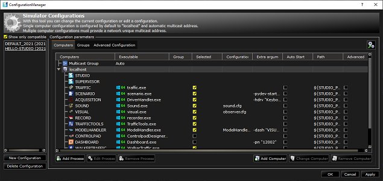
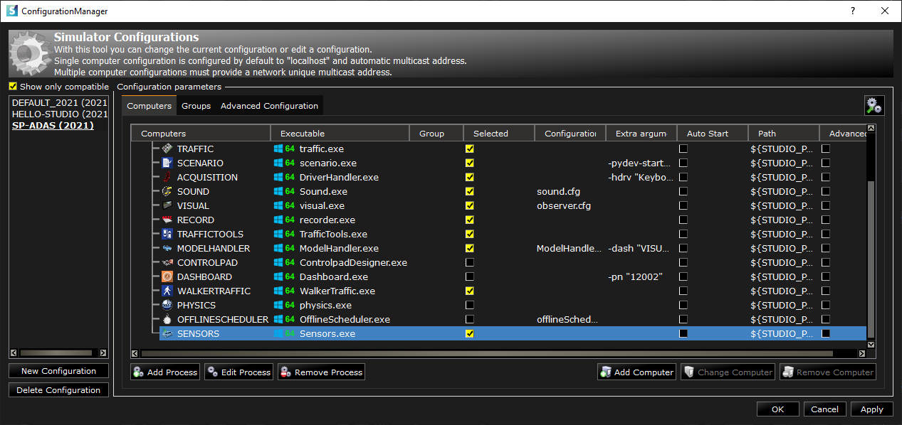

# How to? evaluate and validate an ADAS system

You now have a local simulation environment configured for the SCANeR SDK and you're ready to design your first SCANeR experimentation!
If you run SCANeR studio on your environment for the first time we advise you to read the [How to? run SCANeR studio for the 1st time] ()

This guide explains how to design an experimentation to evaluate and validate an ADAS system
- Step 1. Build a workspace for ADAS system evaluation and validation
- Step 2. Prepare a sensor model
- Step 3. Build a scenario
  - 3.1 Choose environment
  - 3.2 Choose actors
  - 3.3 Attach sensors
  - 3.4 Design situations
  - 3.5 Define KPI/Metrics
- Step 4. Build a SCANeR program to connect your ADAS system to SCANeR I/O
- Step 5. Evaluate and Validate your ADAS system

The example is going to be fairly simple, but you'll learn the fundamental steps for designing an experimentation and interface an ADAS system to SCANeR I/O.

If you get stuck at any point, you can compare your progress to our SAMPLE_2021_ADAS source configuration.
The tutorial is tested to work with the SCANeR Software 2021.1.

> **Note:** This example requires SCANeR Packs: [Foundation](https://www.avsimulation.com/pack-foundation/), [AD/ADAS](https://www.avsimulation.com/pack-ad-adas/).
> 
> Don't have it? [Ask your SCANeR Trial now](https://www.avsimulation.com/scaner-studio-trial/)

## Step 1. Build a workspace for ADAS system evaluation and validation

### 1.1 Build workspace

1. Open SCANeR studio on your system and go to `CONFIGURATION\Configuration Manager...`

2. Click on `New Configuration` and build `SP-ADAS` workspace from `DEFAULT` workspace following instructions

Your `SP-ADAS` workspace is ready :thumbsup:

Let's add `SENSORS` module to it!

> **Note:** `SENSORS` module enables to manage Functional Sensor models as Radar, Ultrasonic, E-Horizon, Light.
> 
> SCANeR offers 3 levels of sensors
> - [Functional (L1)](https://www.avsimulation.com/pack-ad-adas/),
> - [Realtime Physics (L2)](https://www.avsimulation.com/pack-physics-based-sensors/),
> - [Full Physics (L3)](https://www.avsimulation.com/pack-physics-based-sensors/)

### 1.2 Add `SENSORS` module to workspace

1. Click on `Add Process`, select `SENSORS` module from the `Process Editor` list, click on `Add` and `Close`

2. You're all set for now, click on `OK` to load your workspace and let's prepare our scenario :blush:

## Step 2. Prepare a sensor model
In this step, we'll use the `radar` sensor functional model (L1).

SCANeR comes with a set sensor models to help you to begin. To view and edit sensor models go to `RESOURCES` tab `Sensors`.

> **Note:** SCANeR functional models are part of [AD/ADAS Pack](https://www.avsimulation.com/pack-ad-adas/). They use simulation logical content and 3D world model to determine a sensor's outputs. These are perfect models returning perfect targets' list. You can add noise to simulate signal perturbation. SCANeR functional models are made for you if you want to focus on the ADAS system himself or simulate without effort any of the 6 Levels of Vehicle Autonomy. If you want to focus on sensor processing check our [Physics Based Sensors Pack](https://www.avsimulation.com/pack-physics-based-sensors/).
")

1. Right click on a radar model and select `Edit as new...`, the `Save sensor as...` GUI appears
> **Note:** Here we'll edit as new `LongRangeRadarSensor` model to begin
2. Save as `LRRS1` your new radar model (xml format). The `Sensor model edition` GUI appears
> **Note:** We advise to use the same sensor model name as the market so you'll find it easily later from SCANeR resources
> This dialog enables to control any sensor's parameters as beam (e.g. quantity, shape, range, etc.)
3. Let's add `Predestrian` mobile obstacle to detection capatibilities. Click on `Edit Targets`, check `Predestrian` and click on `OK`. Click on `Save and close` to get back to SCANeR studio supervision view.

Your `LRRS1` radar model is ready and available from SCANeR resources :thumbsup:

Let's build our scenario (and use `LRRS1` radar model on EGO :wink:)

## Step 3. Build a scenario
In this step, we'll design our experimentation by defining the environment/the proving ground, the actors (EGO, vehicles, pedestrian, animals, etc.), the situation(s), the models (radar, etc.) and the KPI/Metrics we would like to get for post-treatment.

SCANeR comes with a set models to help you to begin. We'll use default ones:
- Environment/Proving ground: Community
- Actors: EGO (CALLAS SmallFamilyCar), Pedestrian (Kid_Boy_02)
- Sensor: LRRS1
- Situation: EGO will be equiped with LRRS1 model and drive by a virtual driver at a contineous speed of 50kmh. Kid_Boy_02 will be deactivated by default. When EGO will be at less than 20 meters of Kid_Boy_02 then we will activate and force Kid_Boy_02 to cross the road without paying attention to EGO.
- KPI/Metrics: Thanks to our ADAS system that we'll connect in Step 4. we'll connect LRRS1 outputs to our AEB inputs. We expect that EGO avoid colision.

1. Go to `FILE\New Scenario`, select `Community` environment and click on `OK`
2. Let's add EGO, from `RESOURCES` tab `Vehicles` drag and drop on a straight road `SmallFamilyCar` (see section `Cars (Callas)`)
> **Note:** CALLAS is AVSimulation dynamics model.
> Would you like to edit CALLAS components (tire, powertrain, suspension, etc.)? [How to? edit CALLAS dynamics model]()
> Would you like to connect your own dynamics model (CarSim, Vi-CRT, CarMaker, etc.)? [How to? interface my dynamics model]()

  2.1 To define the driver as `Virtual`, right click on EGO and select `Edit instance...`
  2.2 From tab `Driver` set `Type` field value to `Virtual driver (automatic)`
  2.3 From tab `Steering wheel control` set `Steering input` field to `Straight line`
  2.4 From tab `Longitudinal control` set `Pedals control` field to `Follow a speed target specified in the command data`
  2.5 From tab `Command data` section `Command type\Point by point` click on `Edit`
    2.5.1 Set column `Time(s)` row `1` to `0` and  row `2` to `60`
    2.5.2 Set column `Speed (km/h)` row `1` to `50` and  row `2` to `50`
    2.5.3 Set column `Gearbox ratio` row `1` to `1` and  row `2` to `1`
  2.6 Click on `OK` to close `Command type\Point by point` edition and click on `OK` to apply changes and close instance edition

3. Let's add LRRS1 on EGO, from `RESOURCES` tab `Sensors` drag and drop `LRRS1` onto `SmallFamilyCar` (wich is EGO :blush:). SCANeR asks you to create a sensors' configuration on this Vehicle, aswer `Yes`. The `Sensor configuraiton edition` GUI appears.
> **Note:** A sensor's configuration is a set of sensor models to attach on a vehicle. From this dialog you'll be able to define each sensor's position/orientation, outputs, etc.
  3.1 Set Position X to 3.5 m
  3.2 Set Position Z to 0.5 m
4. Click on `Save and close`, the `Save sensor configuration as...` GUI appears.
5. Save as `SmallFamilyCar` your new sensor's configuration (xml format). The sensor's configuration including LRRS1 is linked to `SmallFamilyCar`
> **Note:** Since each vehicle model has its own dimensions we can assume that a sensor's configuration will be dedicated to a specific vehicle model. So we advise to use the same name for your sensor's configruation as your vehicle dynamics model.
6. Let's add Pedestrian, from `RESOURCES` tab `Pedestrians` drag and drop on a sidewalk `Kid_Boy_02` (in front of EGO :wink:)
  6.1 To deactivate `Kid_Boy_02`, right click on it and select `Edit instance...`
  6.2 From tab `Vehicle` set `Status` field value to `Inactive` and click on `OK`
7. Let's set up the situation and define KPI (colision true or false)
8. ...

## Step 4.

|                |ASCII                          |HTML                         |
|----------------|-------------------------------|-----------------------------|
|Single backticks|`'Isn't this fun?'`            |'Isn't this fun?'            |
|Quotes          |`"Isn't this fun?"`            |"Isn't this fun?"            |
|Dashes          |`-- is en-dash, --- is em-dash`|-- is en-dash, --- is em-dash|

> **Note:** The **Publish now** button is disabled if your file has not been published yet.
