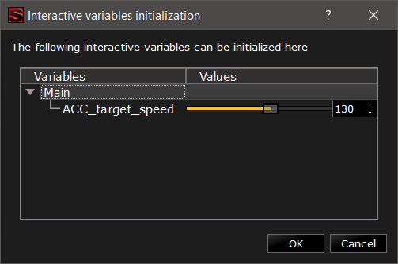
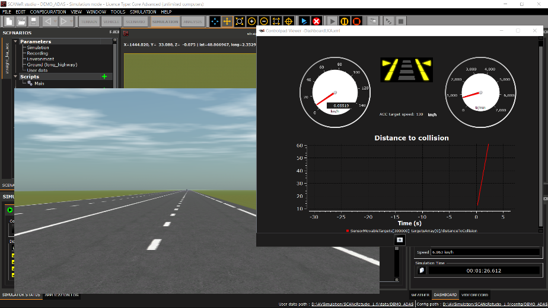
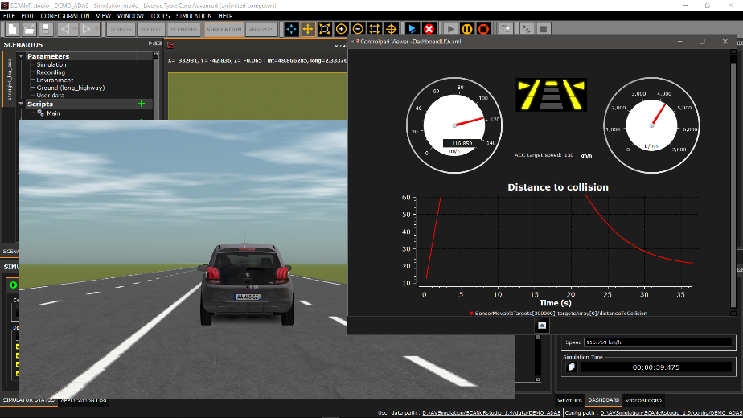
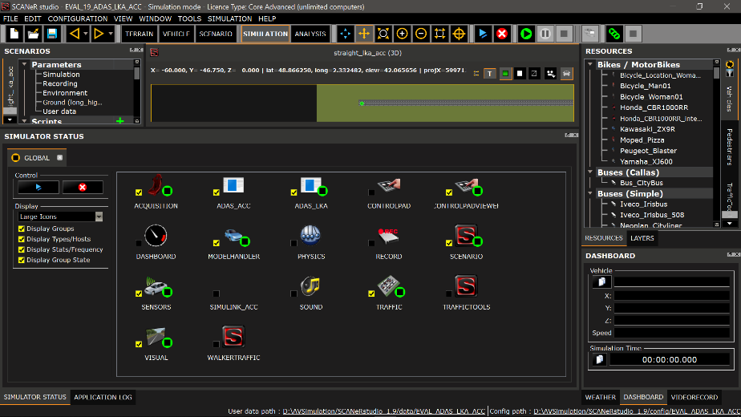
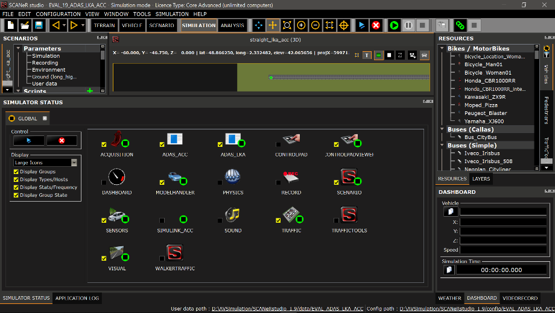
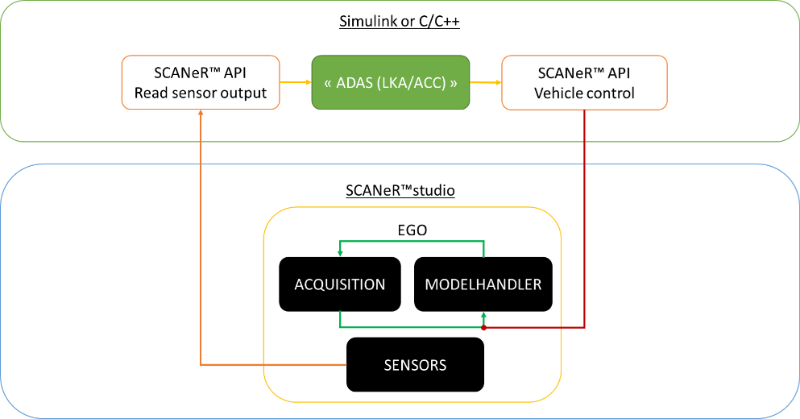
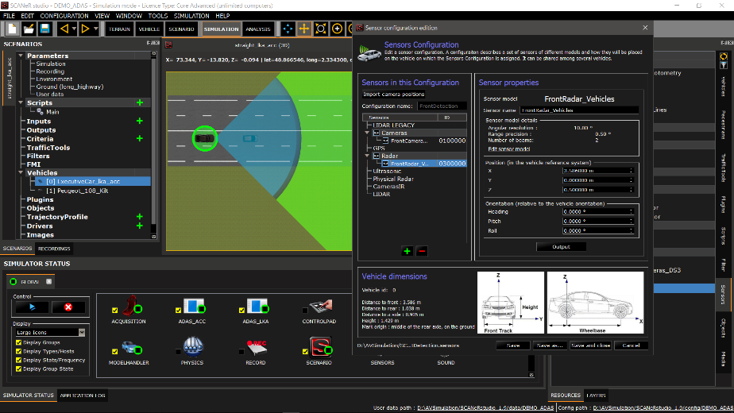
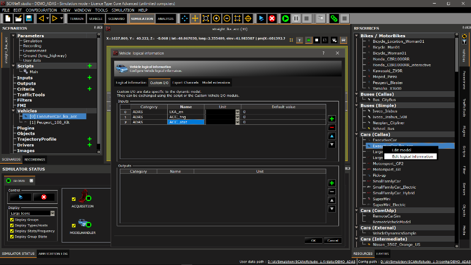
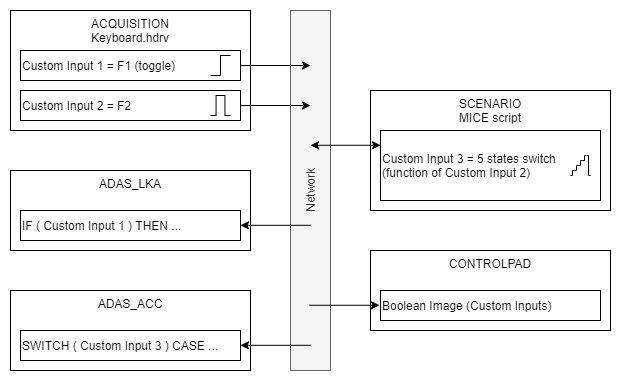
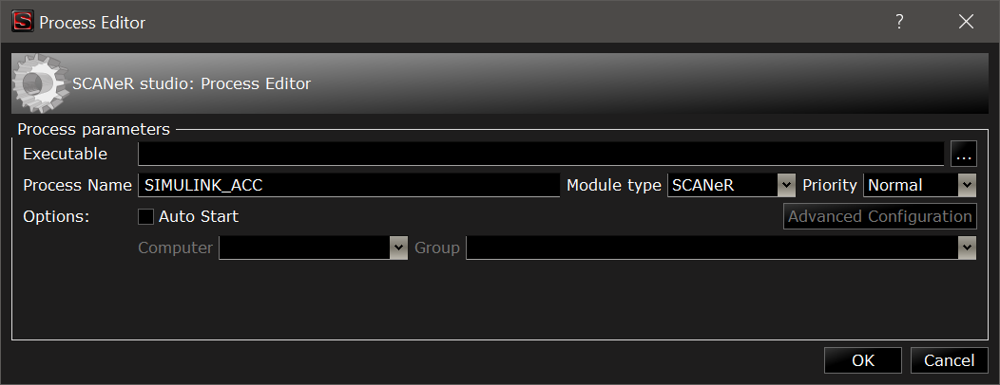

# SAMPLE_ADAS_LKA_ACC

This is a description and user manual of the sample included in the [Samples Pack](https://github.com/AVSimulation/SCANeR-Samples-Pack).

Contents:
* **Goal** of the sample.
* **How to use** with compiled C++ ADAS models.
* **Use the Simulink** ADAS model instead.
* **Detailed explanation** of used features.

## Goal

This sample demonstrates the use of ScanerAPI and other SCANeR features to connect external ADAS algorithms to a SCANeR simulation.  
It may be used as the template for your own experiments.

Two simplified algorithms are used:
*	ADAS_LKA (lane keeping assist, available in C only)
*	ADAS_ACC (active cruise control, available in C and Simulink)

During the simulation, both functions can be activated independently using the keyboard. Effects can be observed on the main visual. A separate window displays the current status of ADAS the functions.

## How to use

1. [Load the SCANeR configuration](../HT_Change_work_environment/HT_Change_work_environment.md) SAMPLE_2022_ADAS_LKA_ACC.  

   *The required modules start automatically.*  
     
   > Notice the custom modules `ADAS_ACC` and `ADAS_LKA`.

   

2. Open the scenario `straight_lka_acc.sce`.

3. Start the simulation.  

   *Set the default ACC target speed.*  
   
     
   
   > This is an interactive variable set in the MICE script.

4. The Ego vehicle can be driven from keyboard arrows `⇧` `⇩` `⇦` `⇨`.  

   *The Target vehicle drives at a constant speed (50 km/h).*  

5. Toggle LKA with `F1`  .

   *The state of the LKQ is in the Controlpad Viewer.  
   The steering wheel turns towards the middle of the lane when the car diverges.*
   
   
   
   > This is the action of module `ADAS_LKA`.

6. Toggle ACC with `F2`.

   *ACC states are `OFF` → `20m` → `30m` → `40m` → `50m` → `OFF`.*
   
   *The car reaches the target speed (set at the beginning of the simulation, 70km/h by default)  
   or it stays behind the Target vehicle if it is closer than the ACC setting.*
   
   *A graph of the distance to collition, as seen by the ACC, is drawn in the Controlpad Viewer.*
   
   > The ACC is meant to work close to (20m to 100m), and at similar speed (±20kmph) compared to the TARGET vehicle. Use the keyboard to reach these conditions.

   

## Use Simulink instead

A Simulink model is provided that does the same as the compiled C module ADAS_ACC.

> MATLAB r2016b is required.

1. Stop the simulation.

2. Stop the `ADAS_ACC` module.  
   (`Right Click > Stop process`, or simply double-click on it)

   

3. Open Matlab r2016b  

   - Navigate to `%STUDIO_PATH%/SCANeRstudio_2022/APIs/`
   - Run the MATLAB script `setupSCANeR.m`
   - Navigate to `./samples/ScanerAPI/ADAS/adas_acc_simulink/`
   - Open the Simulink model `adas_acc_simulink.mdl`
   - Start the Simulink simulation.

   *The module SIMULINK_ACC is now tagged as in state “Daemon”, meaning it is ready to participate to the simulation.*
   
   
  
 4. Start the simulation

    *From there the behaviour is the same as with the compiled module `ADAS_ACC`.*
 
 ## Explanation
 
 * General principle
 * Sensors
 * Driver command
 * Vehicle control
 * Simulink
 
 ### General principle
 
The custom modules `ADAS_LKA` and `ADAS_ACC` are developed in C. Using the ScanerAPI, they get access to the simulation data shared on the SCANeR Network.

They both follow the same architecture:

The C sources are in the Visual Studio 2013 solution `%STUDIO_PATH%/APIs/samples/evaluation.sln` (projects “adas_lka” and “adas_acc”).
 
> In SCANeR's User Manual: `2.2 SCANeR API`.

### Sensors

The Ego vehicle is set to carry two sensors.

- A front CAMERA sensor detects the lanes and lanes (used by the LKA)
- A front RADAR sensor detects the TARGET vehicle (used by the ACC)

 
> In SCANeR's User Manual: `6.7.1.6. Sensors`.

The custom modules ADAS_LKA and ADAS_ACC access the sensor outputs messages available on the SCANeR Network.

- `ADAS_LKA` reads the `ISensor/RoadLinesPoints` message from the CAMERA
- `ADAS_ACC` reads the `ISensor/SensorMovableTargets` message from the RADAR

> In SCANeR's User Manual: `Network.html`.

### Driver command

The command status (on/off) of the ADAS features are assigned to Custom Inputs.

This is one way to formalize the data exchange between the modules on the SCANeR Network.
The other options include the more generic Export Channels or VEN messages, preferred when no application-specific interface exist in SCANeR.

-	Module `ACQUISITION` assigns the `Fn` keys to the custom inputs by default.  
  `FnX` → `Custom Input X`  
  A hit on the `F1` or `F2` keys will change the value of the Custom Inputs 1 and 2.  
-	The MICE script accesses and modifies the Custom Inputs.  
  While `ACQUISITION` only set binary states, the script adds more states in Custom Input 3.
-	Modules `ADAS_LKA` and `ADAS_ACC` read the values of the Custom Inputs using the SCANeR API.  
  The ADAS functions are activated depending of the Custom inputs 1 and 3.
-	Module `CONTROLPAD` reads the Custom Inputs to display their values.

> In SCANeR's User Manual: `5.4.2. Custom inputs / outputs`.

### Vehicle Control

For performance issues, SCANeR uses a Shared Memory (Shm), instead of the Network, to manage the data related to advanced vehicles dynamics (i.e. CALLAS).

> In SCANeR's User Manual: `2.2.6.3.4.3. Overload the data from Shared Memory`.

- Lateral control  
  ADAS_LKA applies additional torque on the steering wheel to get lateral control.  
  `ModelCabin/SteeringToModelCorrective`
- Longitudinal control  
  ADAS_ACC change the pedal commands (throttle and brake) to reach the target speed.  
  `ModelCabin/CabToModelCorrective`

> In SCANeR's User Manual: `Shm.html`.

### Simulink

The Simulink model provided clones the code of ADAS_ACC with standard Simulink Blocks.
It reads and write the exact same messages; hence it behaves the same.

- In SCANeR Studio, it is materialized as a dummy module with no executable attached.  
  
- In Simulink, the “Controller” block materialize the link to SCANeR.

> In SCANeR's User Manual: `2.3.5. Co-simulation`.

 
