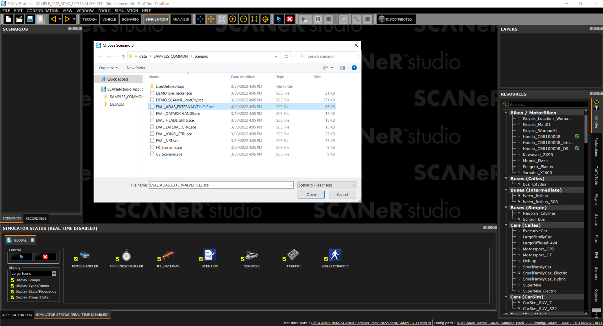
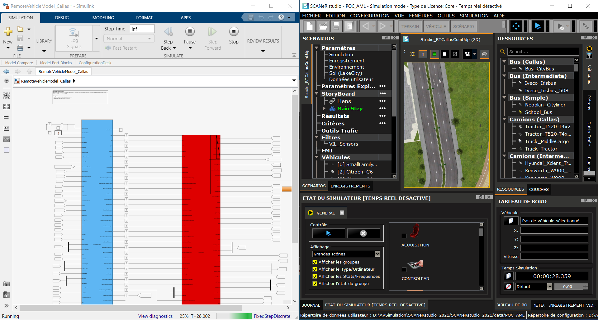

# Sample_ADAS_EXTERNALVEHICLE

This guide explains how to use the Sample "ADAS_EXTERNALVEHICLE" available in the [Samples Pack](https://github.com/AVSimulation/SCANeR-Samples-Pack).

## Goal

This sample shows how to synchronize a Simulink dynamic vehicle model with an ADAS with SCANeR studio in non-real time running at 2000 hz.

## How to use it

Once in the SAMPLE_ADAS_EXTERNALVEHICLE configuration:

* Open the scenario “EVAL_ADAS_EXTERNALVEHICLE.sce”,

* Open MathLab and run “\SCANeRstudio_20xx\APIs\ setupSCANeR.m”,

> This step is necessary only on first time installation. It will add necessary pathes to the MATLAB Set Path and prepare Simulink libraries according to current MATLAB version.

> In SCANeR’s User Manual: `2.3.3.3.1. First time installation`

* Open the Simulink model “\SCANeR-Samples-Pack-20xx\APIs\samples\VehicleDynamics\RemoteVehicleModel\EVAL_ADAS_EXTERNALVEHICLE\RemoteVehicleModel_Callas.slx”,

* Run the Simulink model and all the needed module,

* Play the scenario.

### During the simulation

You will then be able to visualize that the simulink model with ADAS is synchronised with SCANeR.

> Due to the S-function, the vehicle will start after few seconds.

The SCANeR API is accessible in Simulink within the Vehicle Dynamics ComUDP API through RT Gateway and its filter.

> In SCANeR’s User Manual: `2.16. UDP RTGateway protocol`

The operating frequencies of the modules are orchestrated by the Offline Scheduler.

> In SCANeR’s User Manual: `7.28.1. Offline Scheduler`

_______________________________________________

###### :car: Do not hesitate to look at other samples of the [Samples Pack](https://github.com/AVSimulation/SCANeR-Samples-Pack). :car:
