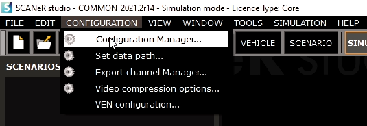
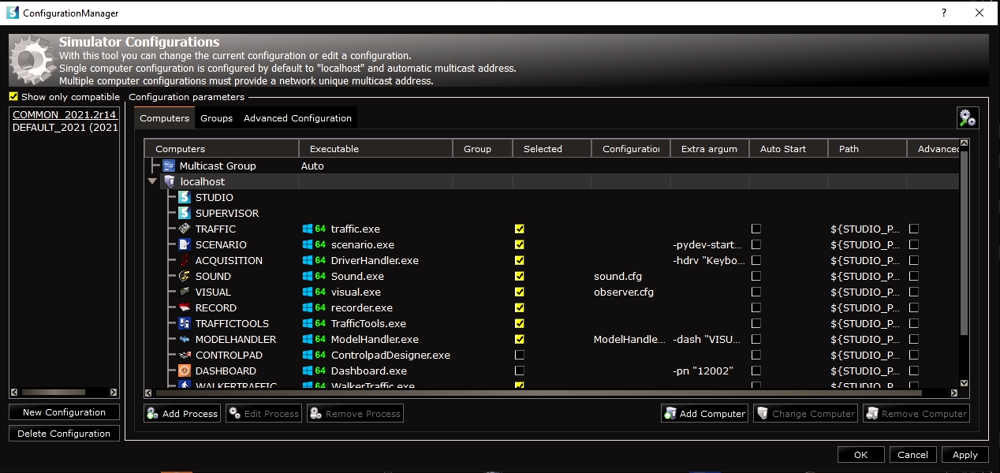

# How to? Switching from one SCANeR workspace to another

As a reminder, in SCANeR Studio, the different workspaces you can have are called Configurations. 
> **Note:** To create a new SCANeR Configuration, follow the instructions here: [How to? Create a new Workspace in SCANeR Studio](../HT_Create_custom_work_environment/HT_Create_A_New_Workspace.md)

This guide explains how to switch to a different Configuration in SCANeR Studio.
- Step 1. Open the Configuration Manager
- Step 2. Switch to another Configuration

## Step 1. Open the Configuration Manager

​	Click on **"CONFIGURATION" -> "Configuration Manager..."** and a window allowing you to manage you different Configurations will appear.

​	You can see your different available configurations here and switch between them.

# Step . Switch to another Configuration

​	You can now select the Configuration you want to open in the list and click on "Apply" in the bottom right corner of the window.
> **Note:** Each Configuration has a specific set of settings and data that will be used when you switch to it. This helps you setup the environment according to the experiments you want to conduct. For instance, the Configuration you will use to make an experiment for AD/ADAS validation will not be the same than the one you wll use to make experiment for Headlight validation.
