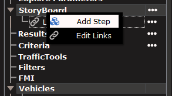
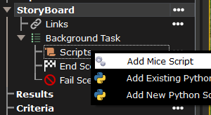
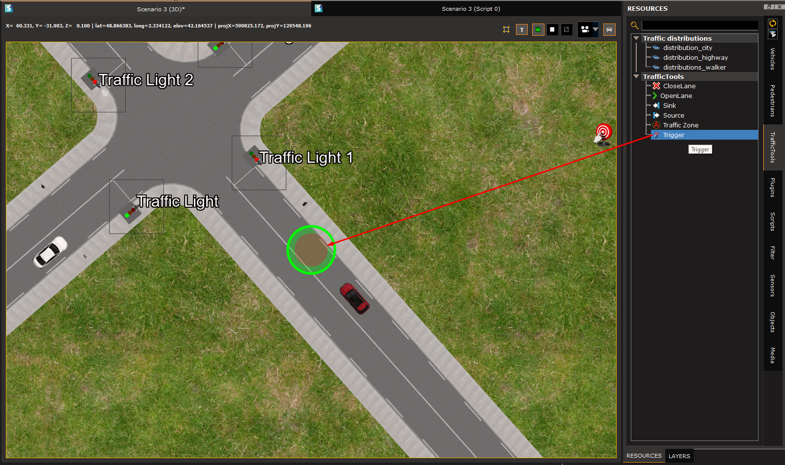
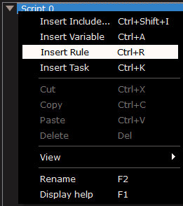
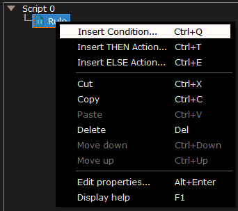
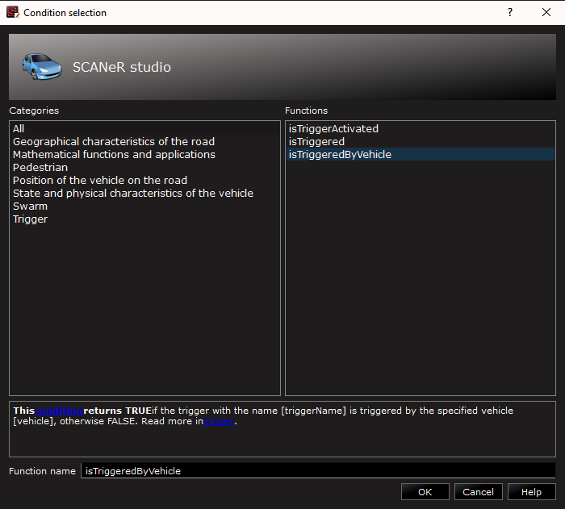
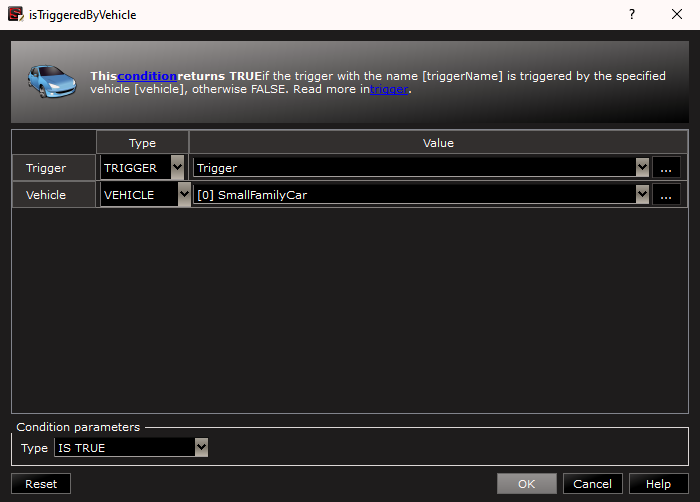
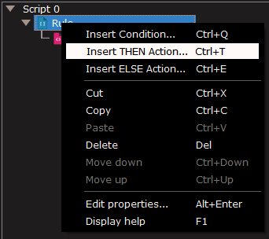
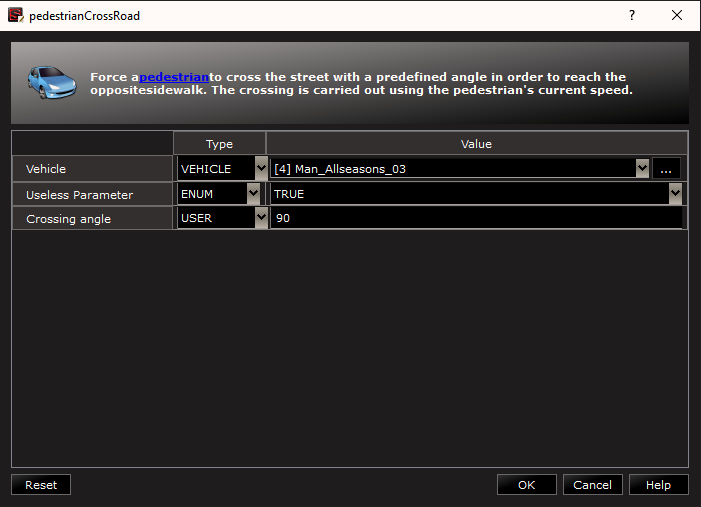

:arrow_left: [Create a scenario based on your road network](../HT_Create_your_first_test_case/HT_Create_your_first_test_case.md)

# How to create a situation?

In SCANeR, you can controal any `Scenario` actors (e.g. cars, pedestrian), parameters (e.g. weather, etc.) and more thanks to M.I.C.E.
M.I.C.E means My Interface to Create my Experimentation. It is offered by SCANeR to enable any user to easily design storyboard by getting access to all SCANeR I/O.
Thanks to these you'll be able to trigger any type of events (e.g. traffic jam, emergency braking, cutin, cutout, etc.), design custom metrics/KPI, etc.
No need to have any development background or knowlege, it is an intuitive and powerfull tool giving you access to more than 300 functions (e.g. pedestrianCrossRoad, getSpeed, getPosition, etc.).

There are many ways to script events, to begin, we'll script the behavior of a pedestrian, so he crosses the road when the EGO Vehicle hits a specific position.

Step 1. Create the scenario and prepare the situation
Step 2. Design your storyboard

Let's jump into the guide!

## Step 1. Create the scenario and prepare the situation

1. First of all, we have to add a `Step` to our `Scenario`. To do this, right click on `StoryBoard` and select `Add Step`. Then, in the `Step` you have just created, right click on `Scripts` and select `Add MICE script`.

 

2. Before editing the script, we'll first place a `Trigger`. Such tool enables us to detect a position of a specific actor and trigger an action, here we'll use it to make the pedestrian cross the road. To do this, go in the `TrafficTools` tab in the `Resources` dock, and drag and drop the `Trigger` object in front of the EGO vehicle.

> A trigger offers the possibility to monitor, in the whole 3D view, moves of vehicles through circular or rectangular locations. 

## Step 2. Design your storyboard

1. To edit the script, double click on it, and the script editing interface opens. To start writing our script, we need to add a new `Rule`. To do so, right click on `Script 0` and select `Insert Rule`.

> A `Rule` is a conditional structure to say "IF something happen THEN I'll do that ELSE I'll do this". 

2. Then you need to add a new condition to your newly created `Rule`. Right click on the rule, and select `Insert Condition...`.

You will be prompted to choose which condition you want to add. In our case, we'll use the `isTriggeredByVehicle` condition. Just type the function you are looking for in the bottom of the window and select it in the right panel.
   
> `isTriggeredByVehicle` condition returns TRUE if the trigger is triggered by a specific vehicle, otherwise FALSE. 

> Keep in mind that you can always look for help in the scripting documentation by clicking on `HELP\Scripting Help` or click `F1`

After clicking on `OK` a new GUI appears in order to parameter the function correctly. In our case, the trigger named `Trigger` has to be hit by the vehicle called `[0] SmallFamilyCar`.

3. After your condition is setup correctly, we need to select the `Action` that will be executed when the condition is verified. To do this, right click on the `Rule` and select `Insert THEN action...`. 

As for the `Condition` you have setup previously, you'll be asked to select the function you want to execute when the condition is met. In that case, we want to make the pedestrian in front of the car cross the road. The function to do this is `pedestrianCrossRoad`.

In the supervision view, we want the pedestrian called `Man_Allseasons_03` (which is the one in front of my EGO vehicle in my case) to cross the road. We just have to change this parameter.

4. Your Storyboard is now operational! It should look like this:

   

You can now save your scenario and execute it. If you need help for the execution, check out our article about it: [Run a simulation](../HT_Run_a_simulation_good_practices/HT_Run_a_simulation_good_practices.md)

The execution of this Storyboard should look like this:

<video src="./assets/Crossing.mp4" controls="controls" style="max-width: 730px;"></video> 

:arrow_right: [Configure the visual rendering: adjust the set up to best fit your needs](../HT_configure_visual/HT_configure_visual.md)
