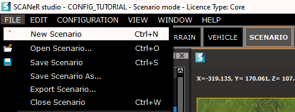
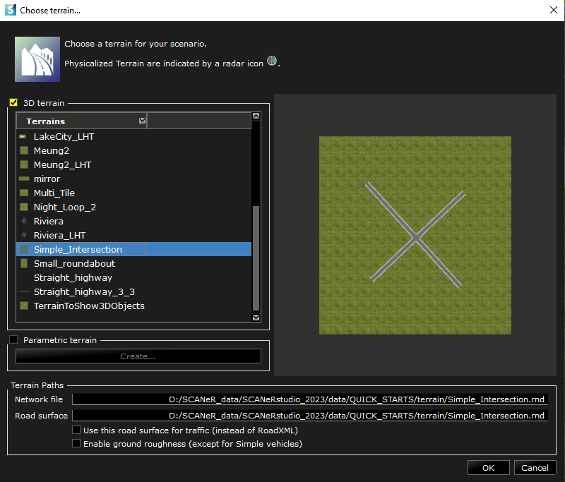
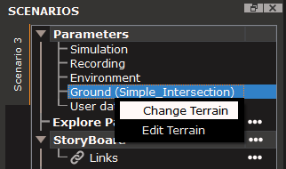
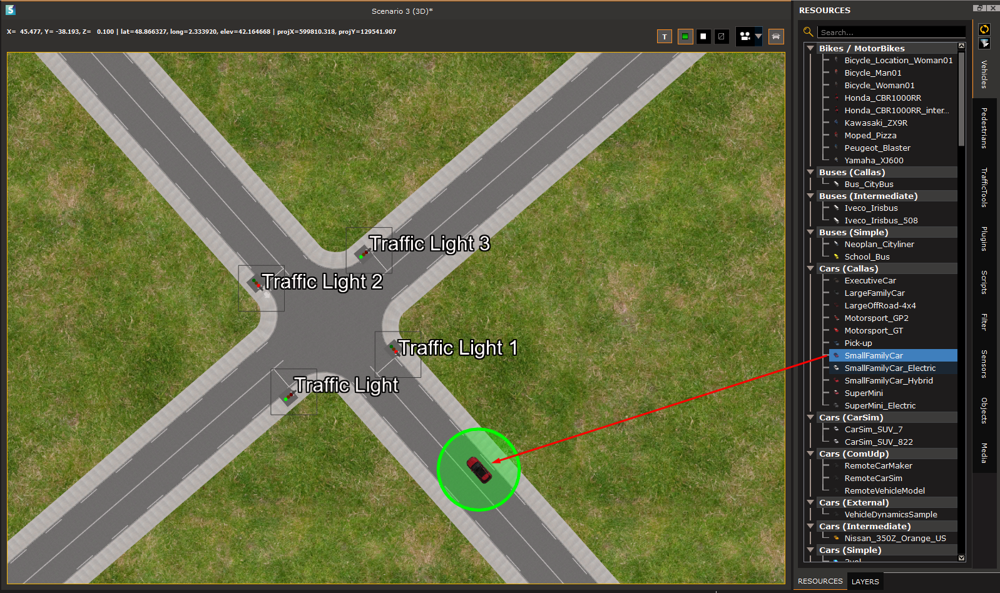
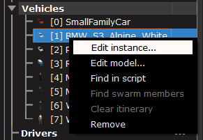
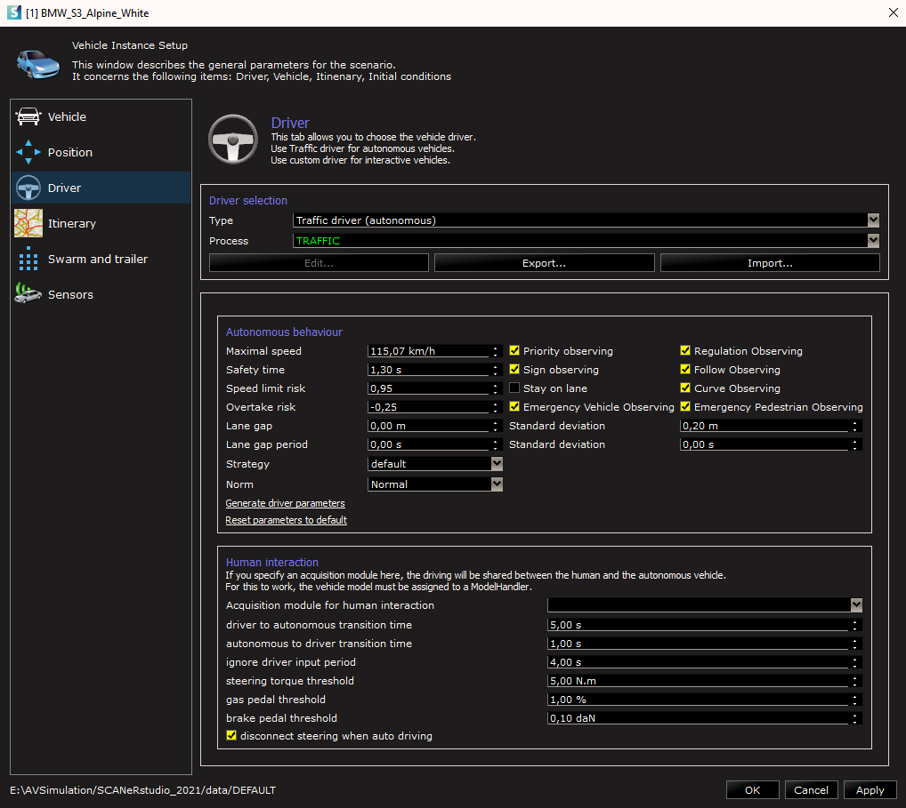

# How to create a scenario based on your road network

In SCANeR, every test case has to be created as a `Scenario`. Each `Scenario` takes place on a specific `Terrain` and involves different `Actors`. In this section, you will create your first `Scenario`. 

- Step 1. Create the scenario
- Step 2. Populate the scenario

## Step 1. Create the scenario

1. Create a new `Scenario` by clicking on `File\New Scenario` in SCANeR `SCENARIO` mode

   

2. Select the `Terrain` on which you want your `Scenario` to take place. In my case, I'm choosing the `Terrain` I created in the previous step.

   

   > Don't worry, you can always change the `Terrain` by right clicking on `Ground` in the parameters and clicking on `Change Terrain`
   >
   > 

## Step 2. Populate your scenario with actors

1. Choose the EGO vehicle of your scenario. This will be the vehicle on which the `VISUAL` module will be focused. Once you have chosen, you can simply drag and drop the vehicle from the resources to the terrain at the location you want.

   

   > The type of vehicle here is a CALLAS vehicle. This is a vehicle that has a full vehicle dynamics. There are other types of vehicles, and they are all in the resources.

2. Add other actors is your scenario. You can add Cars, Pedestrians, Trucks, Buses, Motorcycles, and many more. Here is the result I get with my `Scenario`:

   

   > If a vehicle's behavior does not correspond to what you need, you can always edit the instance in your `Scenario`, by right clicking on the vehicle in the scenario inspector, and choosing `Edit instance...`. You can then change every parameter for this vehicle's instance. 
   >
   > 
   >
   > 

Congratulations! You have created your first `Scenario` 👍

Try to execute it by following our tutorial : [Run a simulation](../HT_Run_a_simulation_good_practices/HT_Run_a_simulation_good_practices.md)
