:arrow_left: [How to Configure driver's input](../HT_Configure_driver_input/Configure_Driver_Input.md)

# How to define and record my KPI

​	In this guide we will see how to define and record a **Key Performance Indicator** (KPI). The KPI we will analyze for this example is the driver's reaction time to brake when a pedestrian crosses the road. To do this, we will follow some simple steps. We will first see how to define the KPI in the `SCENARIO` mode, record the `SIMULATION`, and then analyze it using the `ANALYSIS` mode.

* **Step 1.** Setup your scenario
* **Step 2.** Record your simulation
* **Step 3.** Access KPI data

### Step 1. Setup your scenario

​	In order to measure the driver's reaction time to brake when a pedestrian crosses the road, we need a scenario with a vehicle, a trigger and a pedestrian (Inactive) on the same road. The pedestrian must cross when the vehicle arrives.

We will not explain here how to do it but here are the screenshots of the Top view and the script allowing to make this scenario base.

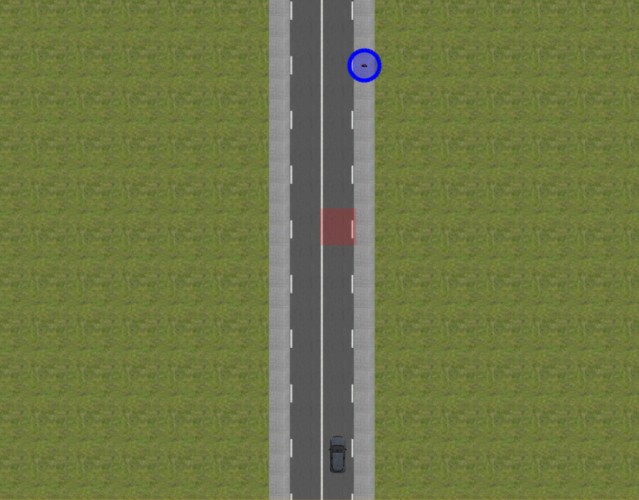

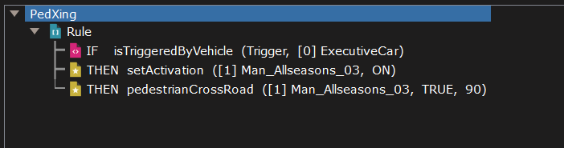

##### Define your KPI:

​	To define your KPI in order to be accessible in the `ANALYSIS` mode, you need to send the information you want on an `exportChannel`.
> **Note:** An export channel is a range of open channels on SCANeR simulation bus for end-users to easily exchange custom I/O with SCANeR environments.

To do so, you need to create a script:

1. Click on the three white dots on the right of `StoryBoard` in `SCENARIOS` dock.
2. Add a `Step`.
3. Then add a `Mice Script`.

> **Note:** You can as well use a Python Script. All the documentation is available in the SCANeR studio documentation, part 2.20. PYTHON API.

Once inside your new script, you will need to calculate the time between the moment when the driver brakes and the pedestrian crosses and send it to an `exportChannel`.

For this:

1. Right click on `Script` and insert a `Variable`.
   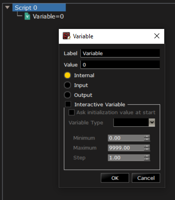

2. Add a second `Variable`.

   > These variables will be your time markers for the beginning of the vehicle braking and the beginning of the pedestrian movement. You can call them `t1` and `t2` for instance.

3. Then right click on `Script` again and insert a rule.

4. With a right click on this rule, add a `isPedestrianCrossing` condition (Type: `BECOMES TRUE`).

   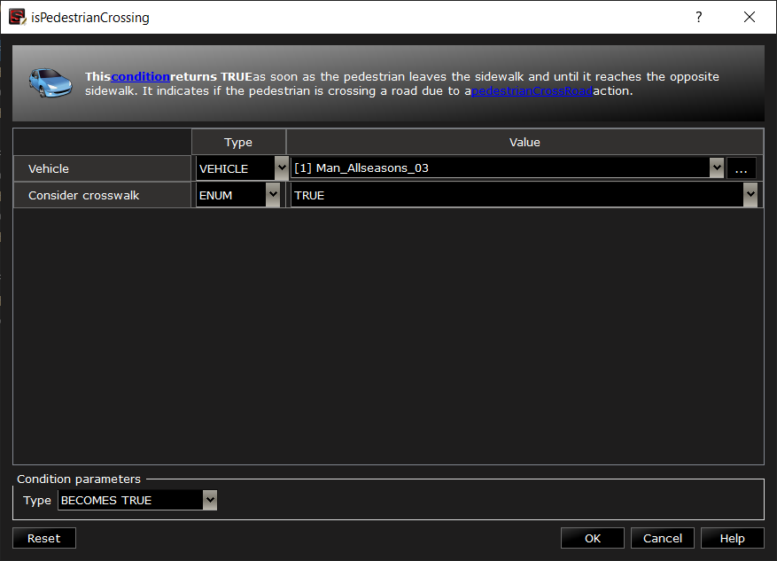

   This condition returns TRUE as soon as the pedestrian leaves the sidewalk and until it reaches the opposite sidewalk. It indicates if the pedestrian is crossing a road due to a `pedestrianCrossRoad` action.

   > **Note:** All the conditions, actions and functions are describe in the Scripting Help.

5. Once the condition finished, insert a THEN action in the rule. This THEN action will use the function `setVariable` to give a value to one of your variable.

   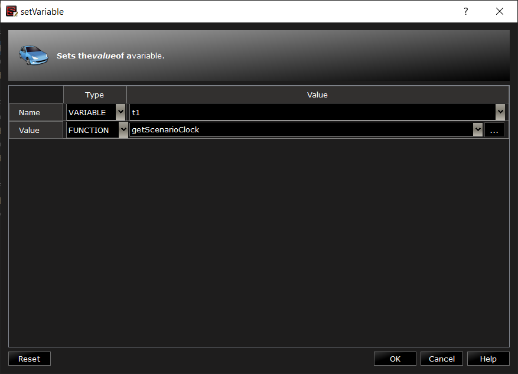

   In this case, use the function `getScenarioClock` to give a value to the variable. It returns the time elapsed from scenario starting, in seconds. (Precision is about 10e-7.)

6. Add another THEN action to the rule to have a time marker without using a variable. That will help in the `ANALYSIS` mode to know exactly when the action occurred.

   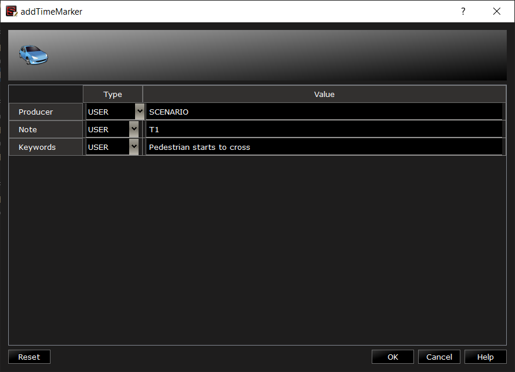

7. You finished your first rule, let's create a second one. 

8. With a right click on this new rule, add a `is >` condition (Type: `BECOMES TRUE`).
   This condition will compare the function `getBrakePedal` with `0`.

   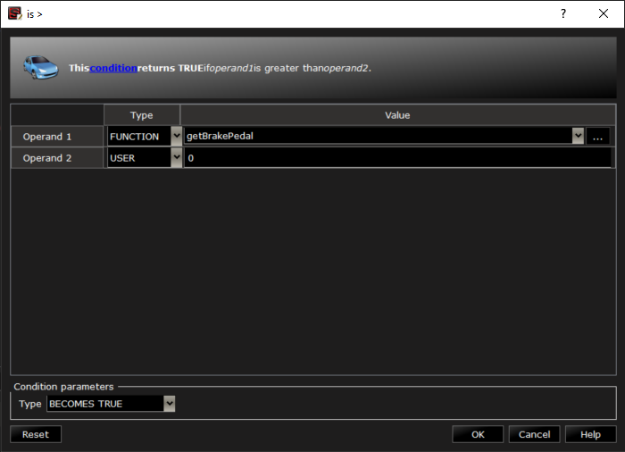

   The `getBrakePedal` function returns the force applied on the brake pedal (0 if released).

9. Associate the `getBrakePedal` function with the car.

   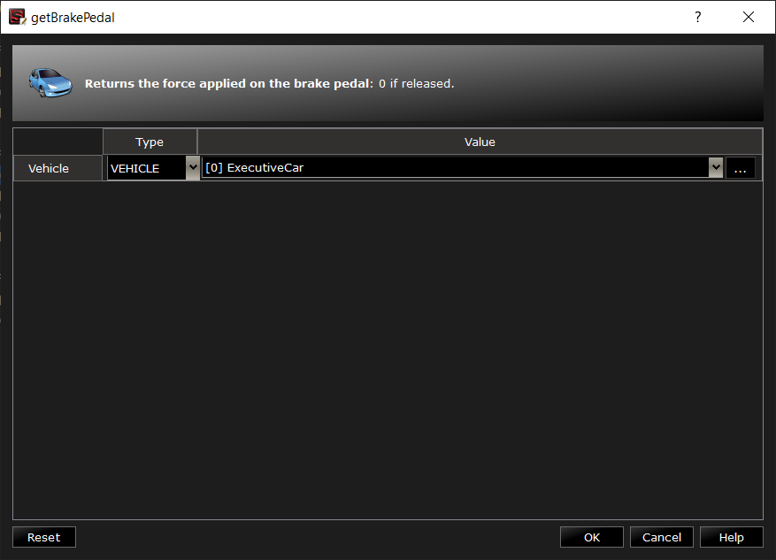

10. Once the condition finished, repeat the steps **5** and **6** for your second variable `t2`.

11. You now have your two variables set, you just need to send the time difference (`t2` - `t1`) to an `exportChannel`. To do this, create a final rule with a `isTrue` condition.

    > **Note:** A `isTrue` condition always returns TRUE.

12. Before adding an action, you must create a new `exportChannel`. To do this, click on `CONFIGURATION` above the toolbar and open the `Export channel Manager`. Thanks to the green **+**, you can add a new `exportChannel`.

    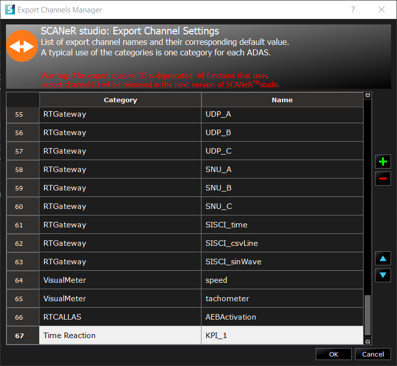

    > **Note:** Don't forget to add a Category and a Name.

13. It is now time to add a THEN action in which we will use the `setExportChannelByName` action and the `exportChannel` you just create.

    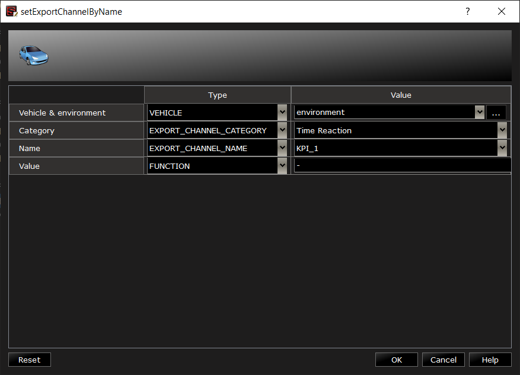

    This action is used to exchange data (one float value per channel) on the SCANeR network.

    The Value here uses the `-` (minus) function to subtract the two variables.

​	We are done with the script, we just calculate the time between the moment when the driver brakes and the pedestrian crosses and send it to an `exportChannel`.

At the end, the script should look like this:

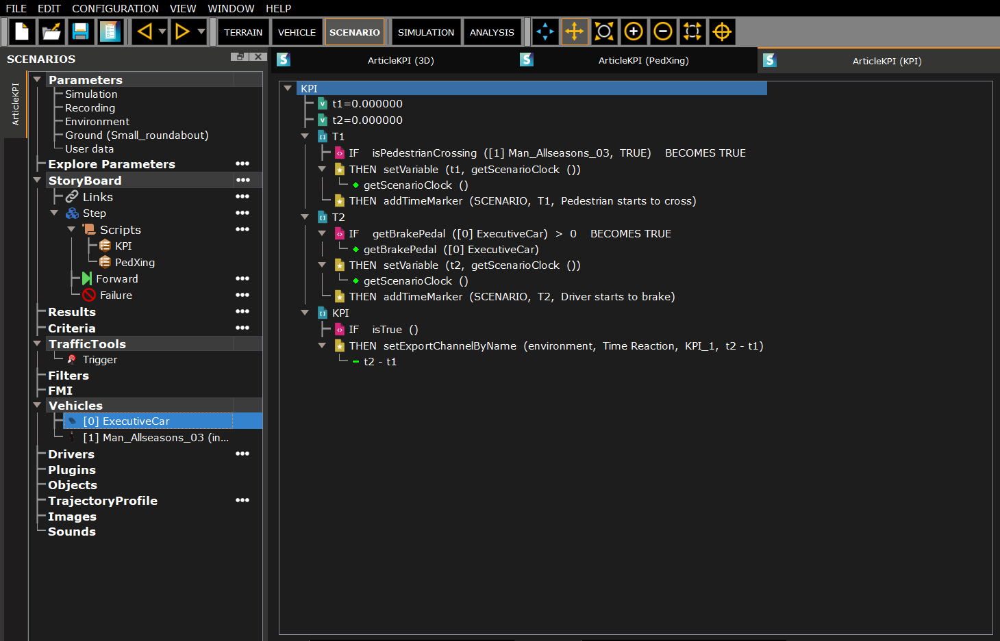

> **Note:** You can rename the script and the rules to have a better understanding of it.

### Step 2. Record your simulation

​	Congratulation, you have finished your scenario! It is time to play it, but before you do, make sure you start all the modules you need.

You will need the `ACQUISITION` and `MODELHANDLER` modules to drive the vehicle, `SCENARIO` to read the scripts, `VISUAL` to find your way in the scene, `WALKERTRAFFIC` to activate the pedestrian's artificial intelligence, and last but not least, the `RECORD` module. The `RECORD` module is used to record all the simulation data like the SCANeR network messages, where you can find your `exportChannel`. If the RECORD module is not run, it will be impossible to analyze the data later.

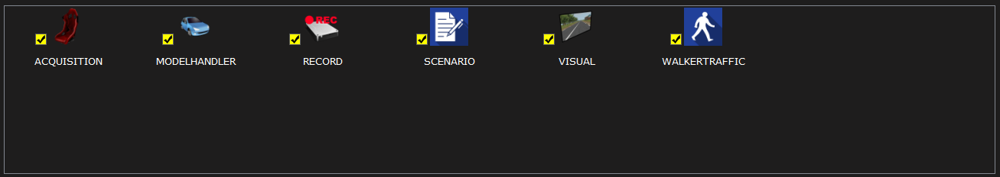

You can now run the simulation. Be sure to brake in time! :innocent:

### Step 3. Access KPI data

​	Once your simulation is complete, you will need to go in the `ANALYSIS` mode and and open the concerned simulation. 

Here you can find the replay of your simulation, your time markers and the graph containing the values of your `exportChannel`. 

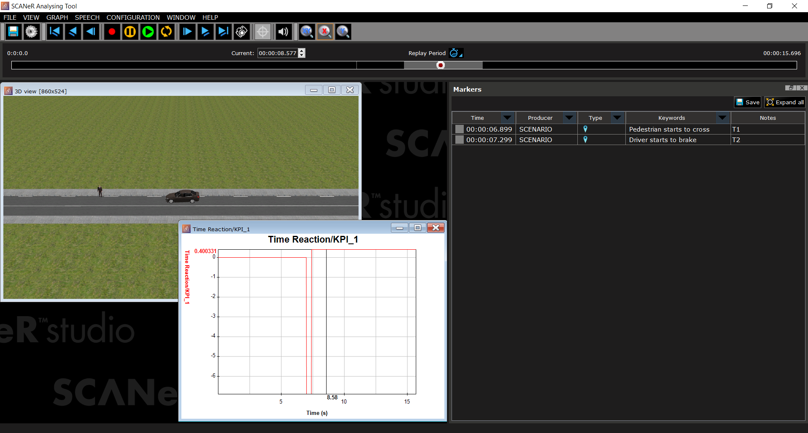

To display the graph, go to `GRAPH` > `New graph...` and select your graph under `Environment` > `ExportChannel`.

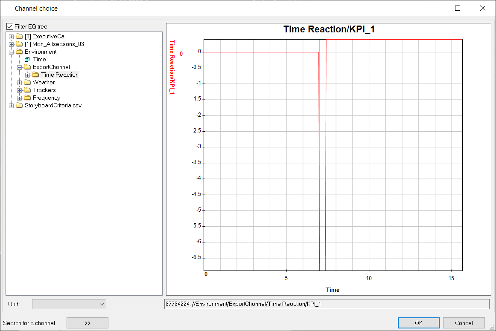

> **Note:** If the graph is not display, check behind the time markers.

> **Note:** Once your graph is displayed, you can extract its value into a CSV file. To do this, go to `GRAPH` > `Current graph` > `Export to csv...`

To come back to our example, the driver's reaction time to brake when a pedestrian crosses the road is the value available after the T2 time marker. 

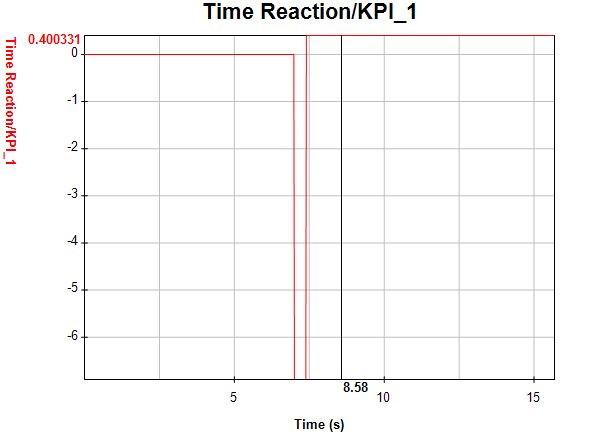

Here, the driver brakes after 0.400331s.

### Conclusion

​	To sum up, thanks to the `SCENARIO` mode and the scripts, you can define your KPI and send it to an `exportChannel`. This will allow you, if the `RECORD` module is started during the simulation, to analyze your KPI in the `ANALYSIS` mode.

I hope you enjoy this tutorial! If you like this kind of content, check out our [SCANER SOFTWARE RESOURCES](https://avsguillaume.github.io/Samples-Pack/) for more. :wink:

:arrow_right: [Sample Pack guides](../../index.md#SCANeRsamplespack)
