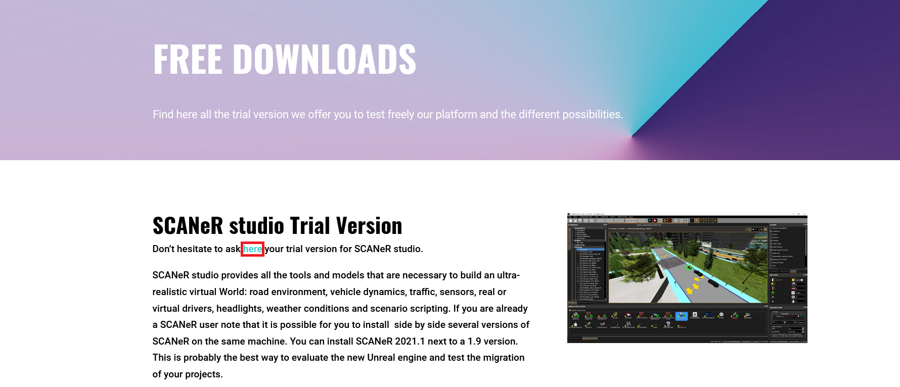

# How to? Download the Trial version of SCANeR studio

You want to accelerate and secure the development of tomorrow's mobility solutions? Downloading SCANeR studio is a first step to achieve this goal 😊:

This guide explains how to download the trial version of SCANeR studio
- Step 1. Request a trial version
- Step 2. Receive a link to download the trial
- Step 3. Install the trial

The trial version gives you access to all software `Packs` including [Foundation](https://www.avsimulation.com/pack-foundation/), [AD/ADAS](https://www.avsimulation.com/pack-ad-adas/), [Headlights](https://www.avsimulation.com/pack-headlights/), etc.

## Step 1. Request a trial version

1. Go to the [Free Downloads](https://www.avsimulation.com/free-download/) page of AVSimulation website  
> **Note:** From the home page, access this page via menu `SCANeR > Free Downloads`  

2. On the Free Downloads page, you can ask for your trial version

> **Note:** You can also request a trial for our other tools: UTAC Ceram scenarios & Physics Based Sensors Level 2 

3. Just enter your information, click on `SEND` and you are ready to move to the next step!👏

## Step 2. Receive a link to download the trial

1. Open your favorite mail service, you should receive an email from your AVSimulation sales excecutive

2. Click on the first Donwload link and click on `Download` on the file transfer website
> **Note:** You have one week to use this link to download the trial ⌚

3. The download begins!  

> **Note:** In addition, the email also include a link to the `Samples Pack`. It is a set of ready to use demonstrations of SCANeR features. For the details on how to install this Samples-Pack, it is here: [How to? Install Samples-Pack]()

## Step 3. Install the trial

To install SCANeR, follow the instructions here: [How to? Install SCANeR studio](../HT_Install_SCANeR_studio/HT_Install_SCANeR_studio.md)

Congratulations ! You are now ready to use the trial version of SCANeR studio 🙌

> **Note:** Once installed, SCANeR Trial Version will expire after 45 days (but can be extended for an additional 30 days).

