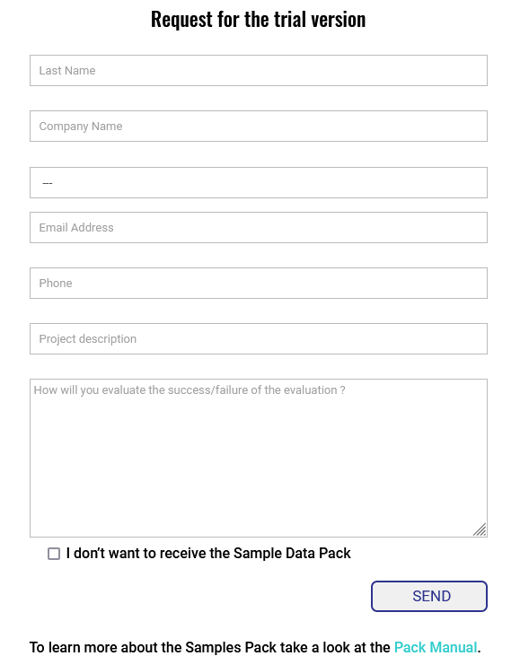

# How to? Download the Trial version of SCANeR Software

You want to accelerate and secure the development of tomorrow's mobility solutions? Downloading SCANeR is a first step to achieve this goal 😊

This guide explains how to download the trial version of SCANeR:
- Step 1. Request a trial version
- Step 2. Receive a link to download the trial
- Step 3. Install the trial

The trial version gives you access to all software `Packs` including [Foundation](https://www.avsimulation.com/pack-foundation/), [AD/ADAS](https://www.avsimulation.com/pack-ad-adas/), [Headlights](https://www.avsimulation.com/pack-headlights/), [Massive Simulation](https://www.avsimulation.com/pack-massive-simulation/), etc.
> **Note:** With this trial version, you have access to SCANeR studio (included in the Foundation pack), SCANeR explore and SCANeR compute (both included in the Massive Simulation pack)

## Step 1. Request a trial version

1. You can ask for your trial version of SCANeR here: [Trial](https://www.avsimulation.com/scaner-studio-trial/)

> **Note:** You can also request a trial for our other tools: UTAC Ceram scenarios & Physics Based Sensors Level: [Other Tools](https://www.avsimulation.com/free-download/)

2. Just enter your information, click on `SEND` and you are ready to move to the next step

> **Note:** AVSimulation then receives a request for a trial. After that, your AVSimulation sales excecutive will send you an email with the link to download SCANeR within 48 hours. When you receive this email, go to the step 2.

## Step 2. Receive a link to download the trial

1. Open your favorite mail service, you should will receive an email from your AVSimulation sales excecutive within 48 hours

2. Click on the first Donwload link and click on `Download` on the file transfer website
> **Note:** You have one week to use this link to download the trial ⌚

3. The download begins!  

> **Note:** In addition, the email also include a link to the `Samples Pack`. It is a set of ready to use demonstrations of SCANeR features. For the details on how to install this Samples-Pack, it is here: [How to? Install Samples-Pack]()

## Step 3. Install the trial

To install SCANeR, follow the instructions here: [How to? Install SCANeR studio](../HT_Install_SCANeR_studio/HT_Install_SCANeR_studio.md)

Congratulations! You are now ready to use the trial version of SCANeR. 🙌

> **Note:** Once installed, SCANeR Trial Version will expire after is valid for 45 days (but can be extended for an additional 30 days). Should you have any technical questions please feel free to contact our technical support at support-scaner@avsimulation.fr

