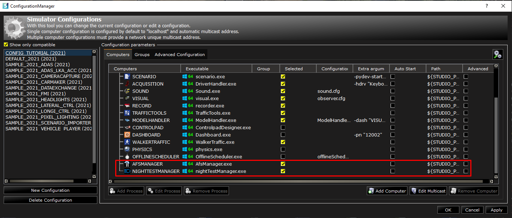
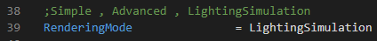
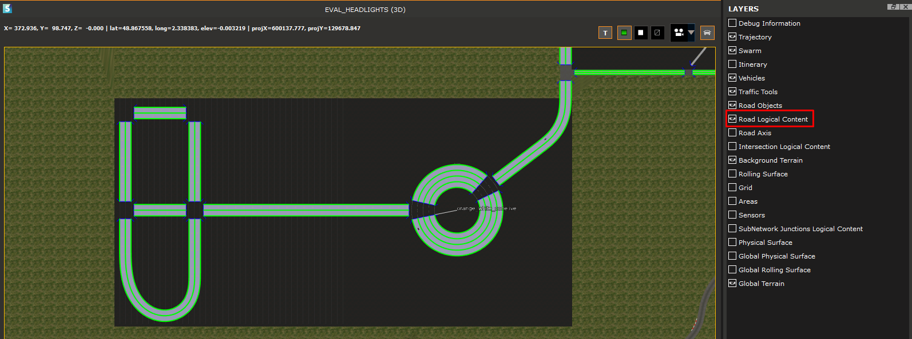
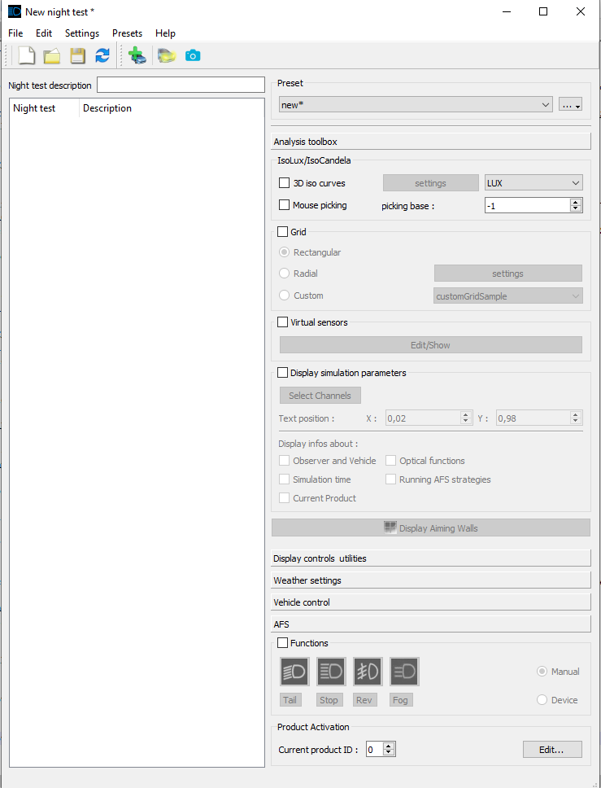
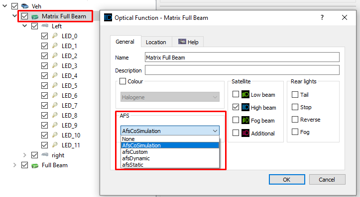
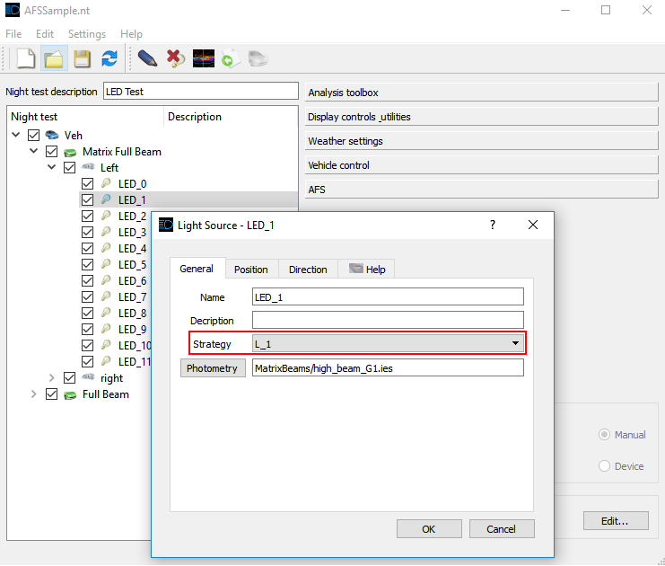
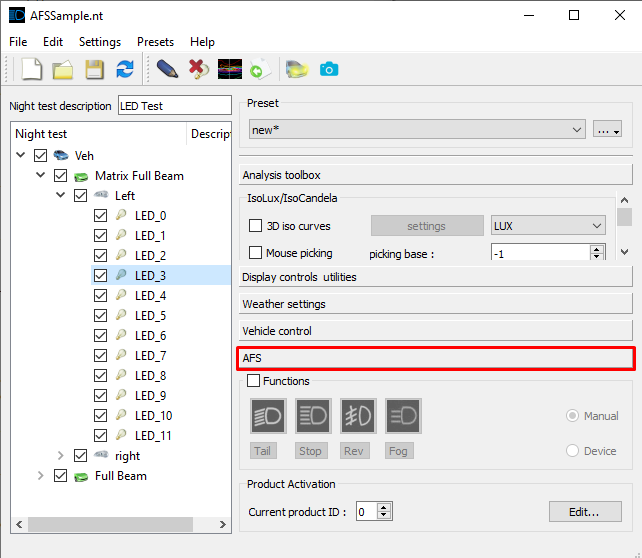
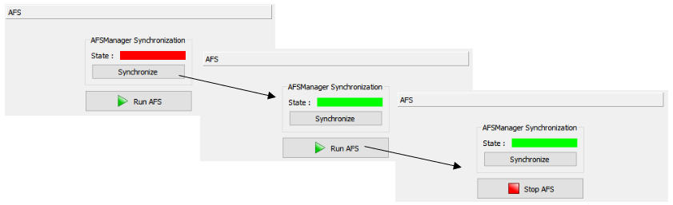

### How to evaluate and validate an command law for lighting AFS

Once you have install the SCANeR Samples Pack ([How to Install the Samples Pack](../HT_InstallSamplesPack/HT_InstallSamplesPack.md)), you may want to test and evaluate a command law for lighting AFS 🔦 
This guide explains how to design an experimentation to evaluate and validate a command law for lighting AFS  
- Step 1. Build a workspace for lighting system evaluation and validation
- Step 2. Prepare command law thanks to SCANeR SDK
- Step 3. Build Headlights SCANeR scenario
  - 3.1. Basic elements of the scenario
  - 3.2. Headlights specifity
- Step 4. Run Cosimulation between SCANeR and Simulink

If you get stuck at any point, you can compare your progress to our SAMPLE_2021_HEADLIGHTS source configuration. The tutorial is tested to work with the SCANeR Software 2021.1.

> **Note:** This example requires SCANeR Packs: [Foundation](https://www.avsimulation.com/pack-foundation/), [Headlights](https://www.avsimulation.com/pack-headlights)   
> The SAMPLE_2021_HEADLIGHTS requires a Matlab license, SCANeR is compatible with the R2016b or R2019b version.  

#### Step 1. Build a workspace for lighting system evaluation and validation
1. In a dedicated workspace, the following SCANeR modules have to be used: `NIGHTTESTMANAGER` and `AFSMANAGER` for Headlights development and research.  

>The `NIGHTTESTMANAGER` is used to create, manage, study and compare in real time vehicles lights. The `VISUAL` module shows the manipulation effects. The `AFSMANAGER` is a tool of `NIGHTTESTMANAGER` used to “run” Adaptive Front light System (AFS) Strategies.  
>For strategies development the AFS API is delivered with SCANeR SDK. The aim of the AFS API is to allow customers to create their own AFS strategy to use in headlight simulation. The AFS API is available with two interfaces: Simulink and C++/DLL (legacy).  

2. Edit the `obersver.cfg` of the `VISUAL` modules by setting the value of RenderingMode on `Lightining Simulation`  

>To learn more about this configuration file check [How to configure the visual rendering](../HT_configure_visual/HT_configure_visual.md)
>The parameter `Lightining Simulation` should be used only for Headlights simulation.

#### Step 2. Prepare command law thanks to SCANeR SDK  
SCANeR SDK gives you access to functions to use headlamp as you wish, either in C/C++ either in Simulink.  
>Would you like to learn more about API development? [How to API creation]()   

In this example we are using a Simulink model, so we have to setup Matlab to use SCANeR SDK.  
1. Launch Matlab, once is running, go to the folder `<STUDIO_PATH>\SCANeRstudio_2021\APIs` and run the file `setupSCANeR.m ` (right click on it and select Run)  
  
>This will add the AFS API pathes and the SCANeR API to Matlab path.

2. You can find an exemple of AFS strategy in  `<STUDIO_PATH>\SCANeRstudio_2021\APIs\samples\AFS_API\Simulink\`  
>Would you like to learn more about using Simulink with SCANeR? [How to use Simulink with SCANeR]() 

#### Step 3. Build SCANeR Headlights scenario  
##### 3.1. Basic elements of the scenario
1. Go to `FILE\New Scenario`, select `Blacklake` environment and click on `OK`  

2. Display the road network layer from `Layers` tick the `Road Logical Content` to see where are the road in the black square.  

3. Let's add EGO, from `RESOURCES` tab `Vehicles` drag and drop `SmallFamilyCar` (see section `Cars (Callas)`) on the straight road in the up right corner, which lead to the round about.

> CALLAS is AVSimulation dynamics model.
> Would you like to edit CALLAS components (tire, powertrain, suspension, etc.)? [How to? edit CALLAS dynamics model]()  
> Would you like to connect your own dynamics model (CarSim, Vi-CRT, CarMaker, etc.)? [How to? interface my dynamics model]()

4. Add a TRAFFIC vehicle, from `RESOURCES` tab `Vehicles` drag and drop any vehicle from section `Cars (Simple)` in the round about.  

5. Add a camera sensor to the EGO vehicle.  
>Don't know how to do it? Check our guide [How to evaluate and validate an ADAS system](../HT_ADAS/HT_ADAS_index.md) 

##### 3.2. Headlights specifity
1. Open `NIGHTTESTMANAGER`. A dedicated window should open.

2. You can define a new NightTest (NT) file, where you can define each element of your headlights (from products, optical functions, projectors then light sources). We recommend you to choose a pre-configured NT files located in `DEFAULT\headlights\nightTest` folder.  
>`NIGHTTESTMANAGER` allows you to easily switch between differents headlights configuration (different products, different projectors, etc.). To learn more about `NIGHTTESTMANAGER` chek check [How to manage headlights simulation]()  

3. To activate the AFS on your headlights system, you need to first double clik on your optical function and select the AFS type you want to use. In this example plaese select the `AfsCoSimulation` parameter

4. Each light sources can have a specific photometry file and a specific AFS strategy. To edit the strategy edit the light source and selected yours.  

>SCANeR can manage different type of photometry file such as: .ies, .hlt, .fta, .mes, .atf and .xrgb  

#### Step 4. Run Cosimulation between SCANeR and Simulink
1. Run the Simulink model  
>In this tutorial we consider that SCANeR and Matlab are running on the same machine. If it is not the case, then make sure that the AFSManager module is executed on the same machine as Simulink (since they use Shared Memory data exchange).

2. Make sure that the following modules are started `ACQUISITION`, `AFSMANAGER`, `MODELHANDLER`, `NIGHTTESTMANAGER`, `VISUAL_HL` and `SIMULINK`. Depending on your command law, `SENSORS` and/or `TRAAFIC` can be mandatory.

>Can't find `SIMULINK` modules? Add a new process to your configuration, let the `executable` field empty and set the process name as `SIMULINK`. This allows you to run a co-simulation between SCANeR and Simulink.
>For more information: [How to use Simulink with SCANeR]() 

3. Run the simulation

4. When the simulation is running, in `NIGHTTESTMANAGER`, press the `Reload` night test configuration button to load products you have defined, otherwise  

5. To synchronise the Simulink strategy model with the Night Test Manager module, go to AFS tab,

6. Click on Synchronize button and then click on Run AFS. The strategy is now running and control according to your command law.  
  

Congratulation ! You can now visualize the rendering of your AFS command law directly in the SCANeR visual.  

