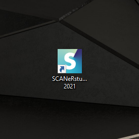
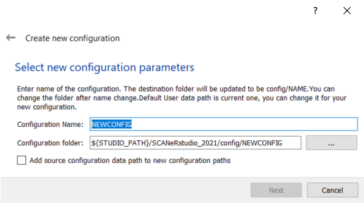
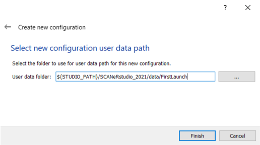

# HOW TO? Launch SCANeR studio for the first time.

This guide explains how to launch and setup your SCANeR studio for the very first time.

**Step 1.** Launch SCANeR studio

**Step 2.** Create a new `Configuration`

**Step 3.** Enter the software

### Step 1. Run SCANeR studio

After installing SCANeR studio, double-click on the shortcut available on your desktop.

If you don't know how to install it, all you need is here: [How to ? Install SCANeR studio.](https://github.com/AVSGuillaume/Samples-Pack/blob/Pages/Pages/HT_Install_SCANeR_studio/HT_Install_SCANeR_studio.md) 😊

Once launched, a window will appear asking you to select a `Configuration` to begin.

In order to not modify the DEFAULT `Configuration`, which will be used as a base and back-up for many future situations, you will have to create a new `Configuration`.
In SCANeR studio, the different workspaces you can have are called `Configurations`. In the context of simulation, these different `Configurations` will help you organize your data and simulation parameters between your different projects. For instance, if you run the simulation on a Workstation, the running modules will not be exactly the same as in a large Simulator environment. That's why you can use different `Configurations` in order to save your parameters and data according to the use case.

### Step 2. Create a new `Configuration`

A new `Configuration` is a copy of an existing one. The DEFAULT `Configuration` is used as a basis for create your first `Configuration`.

Here, your only choice will be the DEFAULT `Configuration`. Click on "Next".

Now choose a name for your new `Configuration`. It can be useful to name your `Configurations` according to their purpose. For example, here I'll call mine FirstLaunch.

The path to the folder of your `Configuration` will be found by default with the other folders of the other `Configurations`. Click on "Next".

The path to the data folder of your `Configuration` will also be found by default with the other data folders of other `Configurations`. Click on "Finish".

### Step 3. Enter the software

You're all set! You can now run your first simulations.

If you need help to navigate through the basic interfaces of SCANeR studio, read this: [How to? Navigate in SCANeR studio.](https://github.com/AVSGuillaume/Samples-Pack/blob/Pages/Pages/HT_Navigate/HT_Navigate.md) 😊

