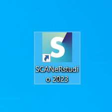
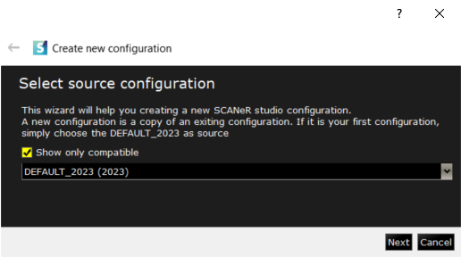
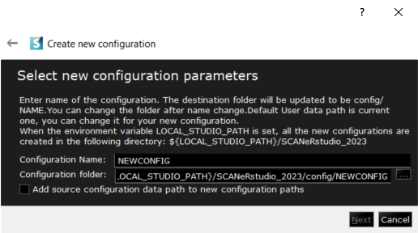
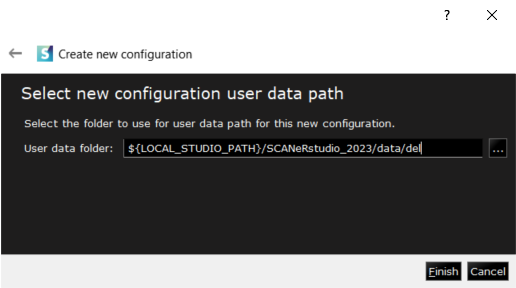

# How to launch SCANeR for the first time

This guide will explain how to launch and setup your SCANeR studio for the very first time.

* **Step 1.** Launch SCANeR studio
* **Step 2.** Create a new `Configuration`
* **Step 3.** SCANeR is ready to use!

<iframe width="560" height="315" src="https://www.youtube.com/embed/pnq0vsR74Xw?start=48" title="YouTube video player" frameborder="0" allow="accelerometer; autoplay; clipboard-write; encrypted-media; gyroscope; picture-in-picture" allowfullscreen></iframe>

## Step 1. Run SCANeR studio

After installing SCANeR studio, double-click on the shortcut available on your desktop.

If you're unsure how to install, everything you need is here: [Install SCANeR.](../HT_Install_SCANeR_studio/HT_Install_SCANeR_studio.md) 😊

Once launched, a GUI will appear asking you to select a `Configuration` to begin.

In order to avoid modifying the DEFAULT `Configuration`, which will be used as a base and back-up for many future situations, you will have to create a new `Configuration`.

> In SCANeR studio, the different workspaces you can use are called `Configurations`. In the context of simulation, these different `Configurations` will help you organize your data and simulation parameters between your different projects. For instance, if you run simulations on a Workstation, the running modules will differ from the ones used in a large Simulator environment. Through the use of different `Configurations`, you can save your parameters and data according to each use case.

## Step 2. Create a new `Configuration`

A new `Configuration` is a copy of an existing one. The DEFAULT `Configuration` is used as a basis for creating your first `Configuration`.

Here, your only choice will be the DEFAULT `Configuration`. Click on "Next".

Now choose a name for your new `Configuration`. It can be useful to name your `Configurations` according to their purpose. For example, here I'll call mine FirstLaunch.

After naming your `Configuration`, Click on "Next".

The path to the data folder of your `Configuration` will be found automatically with the data from other `Configurations` folders. Click on "Finish".

## Step 3. SCANeR is ready to use!

You're all set! You can now run your first simulation.

If you need help navigating through the basic interfaces of SCANeR studio, read this: [Navigate the user interface](../HT_Navigate/HT_Navigate.md) 😊
