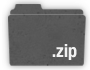
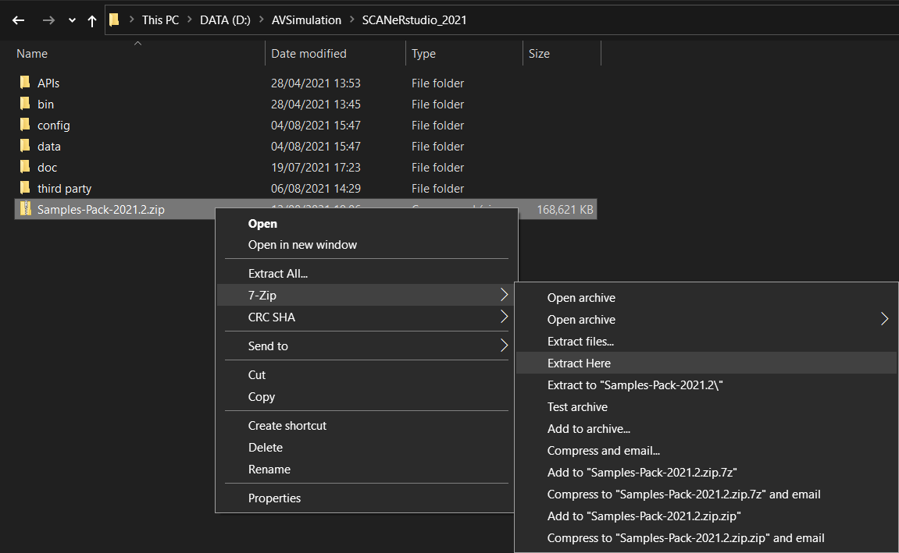
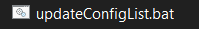

:arrow_left: [How to install SCANeR studio](../HT_Install_SCANeR_studio/HT_Install_SCANeR_studio.md)

# How to Install the Samples Pack.

The Sample Pack includes specific samples of SCANeR configuration, scenario and dependencies. Once loaded, the sample is *click to run*. In addition the sample manual explains exactly what happens during the scenario. It also explains how it was made, so you can quickly *understand*, and *make changes* to match your own application. The *source code* for API-based samples is included often using several of the programming languages.

This guide explains how to get and install the Samples Pack.

* Pre-requisites
* Step 1. Download
* Step 2. Extract
* Step 3. Install
* Step 4. Play

## Pre-requisites

- Windows 10
- SCANeR™ studio license ([request a trial](https://www.avsimulation.com/scaner-studio-trial/))
- The latest version of SCANeR studio

## Step 1. Download

From the top of this page, download the latest version of the Samples Pack.

## Step 2. Extract

Extract the download ZIP in your SCANeR studio installation folder `%STUDIO_PATH%/SCANeRstudio_2021/`.

> **Info:** The data, configuration and source files are extracted according to the SCANeR directory tree, in `data/`, `config/` and `APIS/` respectively.

## Step 3. Install

To finialize the installation, run the newly extracted `samples-pack-utils/updateConfigList.bat` by double-clicking on it.

> **Info:** The script simply updates `%STUDIO_PATH%/configurations.cfg` with the Samples Pack configuration paths.

## Step 4. Play

You have successfully installed the Samples Pack. 🎉

You can launch SCANeR studio and start using the samples. Documentation for each sample can be accessed from the [home page](../../index.md).

:arrow_right: [ADAS test and validation](../HT_ADAS/HT_ADAS_index.md)  
:arrow_right: [Headlights test and validation](../HT_Evaluate_and_validate_AFS/HT_Evaluate_and_validate_AFS.md)
