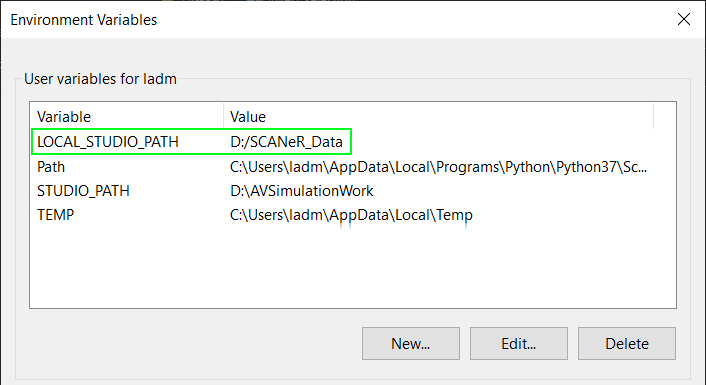

# How to Install the Samples Pack

The Sample Pack includes specific samples of SCANeR configurations, scenarios and dependencies. Once loaded, the sample is *click to run*. In addition the sample manual explains exactly what happens during the scenario. It also explains how it was made, so you can quickly *understand*, and *make changes* to suit your own application. The *source code* for API-based samples is included, often using several of the programming languages.

This guide will explain how to get and install the Samples Pack.

* Pre-requisites
* Step 1. Prepare a folder
* Step 2. Download
* Step 3. Extract
* Step 4. Install
* Step 5. Play

## Pre-requisites

- Windows 10
- SCANeR™ studio license ([request a trial](https://www.avsimulation.com/scaner-studio-trial/))
- The latest version of SCANeR studio

## Step 1. Prepare a folder

You can choose any folder for your SCANeR data and the Samples Pack.
> I like to use `D:/SCANeR_Data` for example.

For that, create the environment variable `LOCAL_STUDIO_PATH`.
* Open windows start menu.
* Find `Edit environment variables for your account`.
* Add variable `LOCAL_STUDIO_PATH`.
* Set the value as the path to your data folder.

## Step 2. Download

From the top of this page, download the latest version of the Samples Pack.

## Step 3. Extract

Extract the downloaded ZIP in your data folder `%LOCAL_STUDIO_PATH%/`.
> It creates the sub folder `%LOCAL_STUDIO_PATH%/SCANeR-Samples-Pack-2022/`

## Step 4. Install

To finialize the installation, run the newly extracted `samples-pack-utils/updateConfigList.bat` by double-clicking on it.
> The script simply updates `%LOCAL_STUDIO_PATH%/configurations.cfg` with the Samples Pack configuration paths.

## Step 5. Play

You have successfully installed the Samples Pack. 🎉

Open SCANeR studio to see the new `SAMPLE_2022_...` configurations in `CONFIGURATION` > `Configuration Manager`.

The documentation for the samples can be accessed from the [home page](../../index.md).
