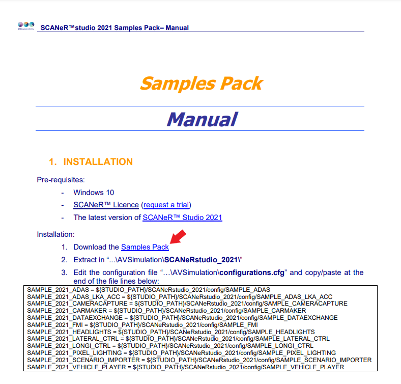
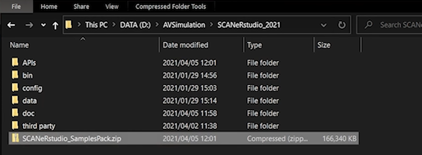
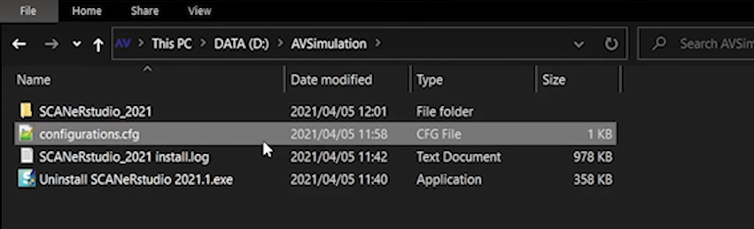
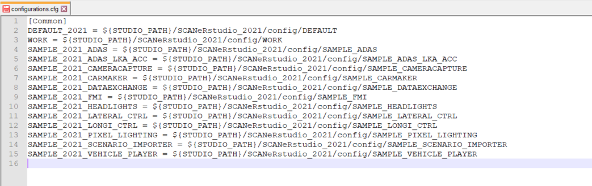
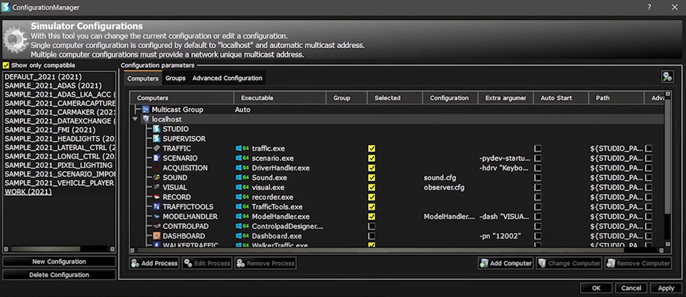
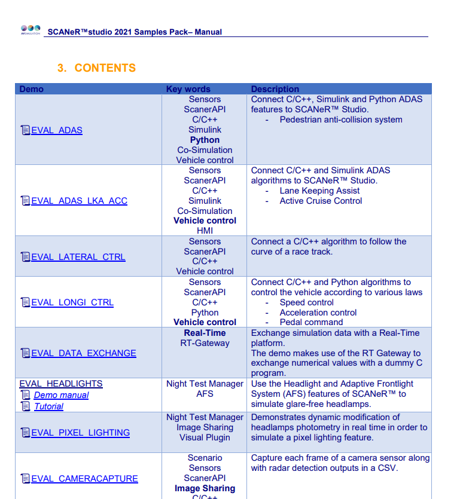

# HOW TO? Install the Samples Pack.

​	The Sample Pack includes specific samples of SCANeR configuration, scenario and dependencies. Once loaded, the sample is **click to run**. In addition the sample manual explains exactly what happens during the scenario. It also explains how it was made, so you can quickly **understand**, and make **changes** to match your own application. The **source code** for API-based samples is included often using several of the programming languages.

This guide explains how to install the Samples Pack. If you prefer, a video tutorial is also available here: [Getting Started with SCANeR: Sample Packs](https://youtu.be/RaJ-1HfnqTM)

**Pre-requisites:** 

- Windows 10
- SCANeR™ License ([Request a trial](https://www.avsimulation.com/scaner-studio-trial/))
- The latest version of SCANeR studio

**Step 1.** Access to the Samples Pack Manual

**Step 2.** Download the Samples Pack

**Step 3.** Extract in “...\AVSimulation\SCANeRstudio_2021\”

**Step 4.** Edit the configuration file “…\AVSimulation\configurations.cfg”

**Step 5.** Contents

### Step 1. Access to the Samples Pack Manuel

To access the Samples Pack Manual, follow this link: [Samples Pack Manual](http://stockage.scanersimulation.com/Evaluation/2021/SCANeRstudio_SamplesPack_2021.pdf)

Or go to our website under the tab "Free Downloads". Click on "Samples Pack"

Then click on "Packs Manual".

### Step 2. Download the Samples Pack

Once in the Manual, you can download the Samples Pack.

You now possess the file:

### Step 3. Extract in “...\AVSimulation\SCANeRstudio_2021\”

You now have to extract this archive into the folder: “...\AVSimulation\SCANeRstudio_2021\”

### Step 4. Edit the configuration file “…\AVSimulation\configurations.cfg”

Once the archive is extracted, you will have to go up one level in the folder architecture to edit the file "configurations.cfg".

Open it and copy paste the lines of text available in the Samples Pack Manual (and here) as shown below.

###### Lines to copy and paste:

> `SAMPLE_2021_ADAS = ${STUDIO_PATH}/SCANeRstudio_2021/config/SAMPLE_ADAS`
> `SAMPLE_2021_ADAS_LKA_ACC = ${STUDIO_PATH}/SCANeRstudio_2021/config/SAMPLE_ADAS_LKA_ACC` 
> `SAMPLE_2021_CAMERACAPTURE = ${STUDIO_PATH}/SCANeRstudio_2021/config/SAMPLE_CAMERACAPTURE` 
> `SAMPLE_2021_CARMAKER = ${STUDIO_PATH}/SCANeRstudio_2021/config/SAMPLE_CARMAKER` 
> `SAMPLE_2021_DATAEXCHANGE = ${STUDIO_PATH}/SCANeRstudio_2021/config/SAMPLE_DATAEXCHANGE` 
> `SAMPLE_2021_FMI = ${STUDIO_PATH}/SCANeRstudio_2021/config/SAMPLE_FMI` 
> `SAMPLE_2021_HEADLIGHTS = ${STUDIO_PATH}/SCANeRstudio_2021/config/SAMPLE_HEADLIGHTS` 
> `SAMPLE_2021_LATERAL_CTRL = ${STUDIO_PATH}/SCANeRstudio_2021/config/SAMPLE_LATERAL_CTRL` 
> `SAMPLE_2021_LONGI_CTRL = ${STUDIO_PATH}/SCANeRstudio_2021/config/SAMPLE_LONGI_CTRL` 
> `SAMPLE_2021_PIXEL_LIGHTING = ${STUDIO_PATH}/SCANeRstudio_2021/config/SAMPLE_PIXEL_LIGHTING` 
> `SAMPLE_2021_SCENARIO_IMPORTER = ${STUDIO_PATH}/SCANeRstudio_2021/config/SAMPLE_SCENARIO_IMPORTER` 
> `SAMPLE_2021_VEHICLE_PLAYER = ${STUDIO_PATH}/SCANeRstudio_2021/config/SAMPLE_VEHICLE_PLAYER`

You will now see that the Samples Pack configurations have been added to your ConfigurationManager.

Each configuration has its own resources already configured:

- Scenari
- Terrains
- Customized modules
- Etc.

### Step 5. Contents

The content of each configuration is detailed in Part 3 of the Samples Pack Manual.

To access the in-depth details, please click on the name of the configurations in the Demo column.

You're all set! You can now enjoy all the possibilities of the Samples Pack. 😊
