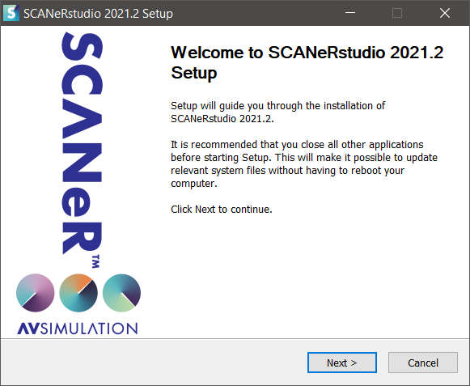
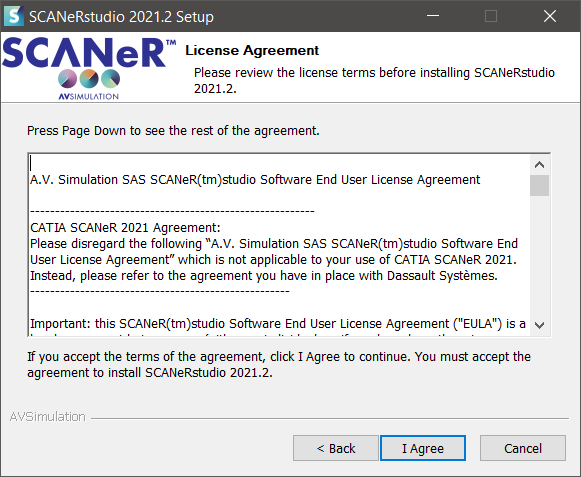
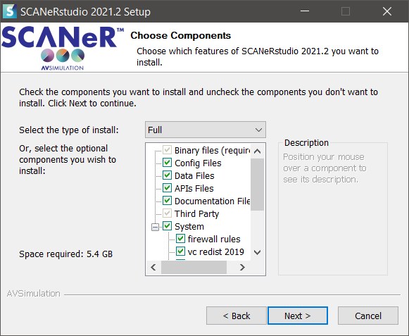
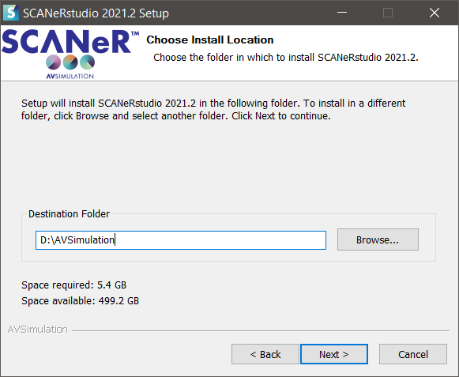
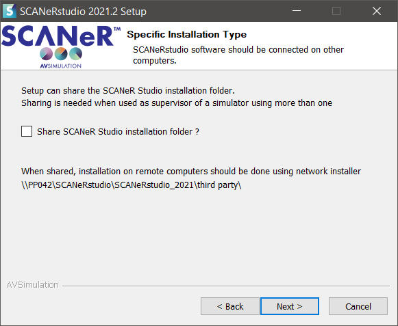
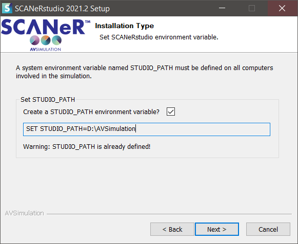
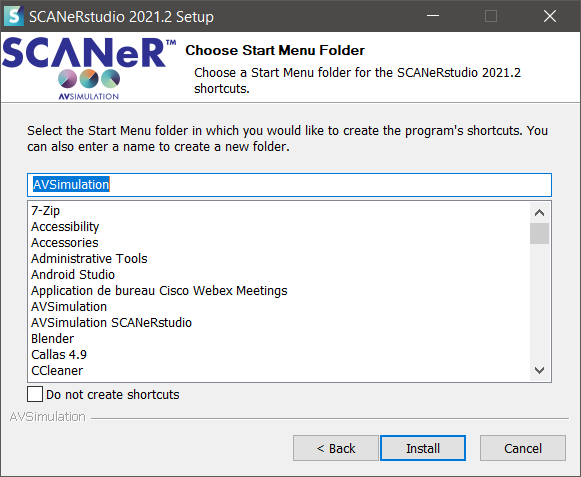
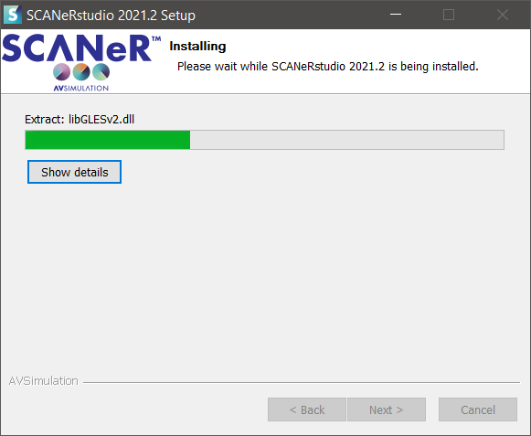
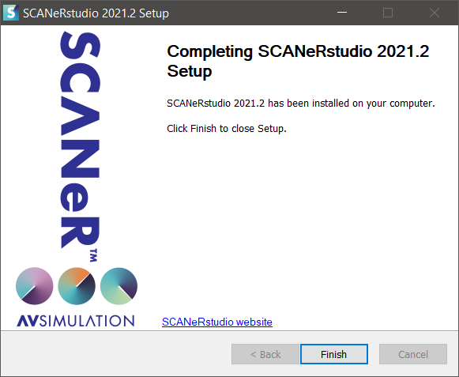

:arrow_left: [How to download the Trial version of SCANeR studio](../HT_Download_Trial_SCANeR/HT_Download_Trial_SCANeR.md)

# How to install SCANeR studio

This guide walks you through the installation process for SCANeR studio.

## Pre-requisites

If you don't have a *SCANeR studio installer* yet, check out [How to download the Trial version of SCANeR studio](../HT_Download_Trial_SCANeR/HT_Download_Trial_SCANeR.md).

The installation of SCANeR studio requires full administrator rights.

## Install SCANeR studio

* Launch SCANeR studio installer ```SCANeRstudio-202X.XrXX.exe```

> **Note:** If you are using the trial version, please unzip ```SCANeRstudio-202X.XrXX_Trial.exe.zip``` to find the SCANeR studio installer.



* Click ```Next```



* Click ```I Agree```



* Leave all components selected

> **Info:** Items include simulation data, configuration files, APIs samples and dependancies for the licensing system, sound and video management.

* Click ```Next```



* Choose the installation folder

> **Note:** We recommend to install SCANeR studio on a different different disk than the system (e.g. ```D:``` instead of ```C:```).

* Click ```Next```



* Sharing the installation folder is required in a multi-computer configuration.

> **Info:** SCANeR studio can work in multi-machine on any architecture (workstation, simulator, HiL, Cloud) as long as all nodes (PC or VM) are on the same local network.

> **Note:** With the Trial installer, leave unchecked. The Trial version doesn't include multi-machine use.

* Click ```Next```



> The system variable is required for SCANeR studio to work.

* Check the box ```Create a STUDIO_PATH environment variable```

* Click ```Next```



* Click ```Next```



* Wait for the completion of the installation

* Click ```Install```



> Installation is finished

* Cick ```Finish```

Congratulations, SCANeR studio is installed !

## License installation

The SCANeR studio Trial installer includes an automatic 45 days license. You can [Start SCANeR studio for the first time](../HT_FirstLaunch/HT_FirstLaunch.md).

If you are a customer, see [How to install your SCANeR license](../HT_Install_SCANeR_license/Install_SCANeR_license.md).

:arrow_right: [How to install your SCANeR license](../HT_Install_SCANeR_license/Install_SCANeR_license.md)
:arrow_right: [How to install the Samples Pack](../HT_InstallSamplesPack/HT_InstallSamplesPack.md)
:arrow_right: [Start SCANeR studio for the first time](../HT_FirstLaunch/HT_FirstLaunch.md)
