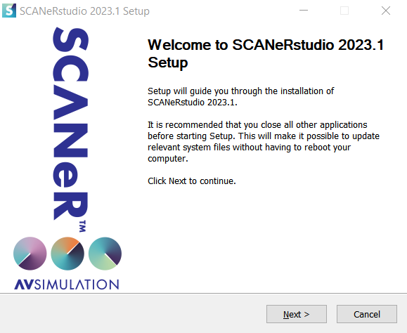
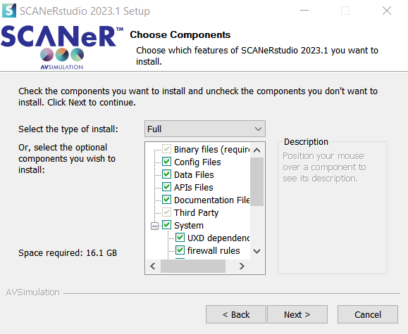
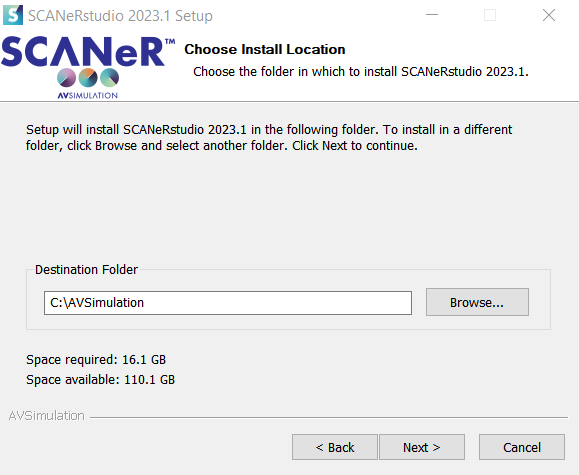
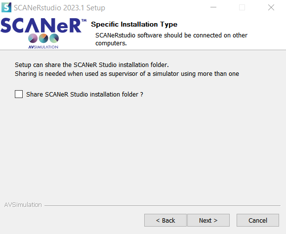
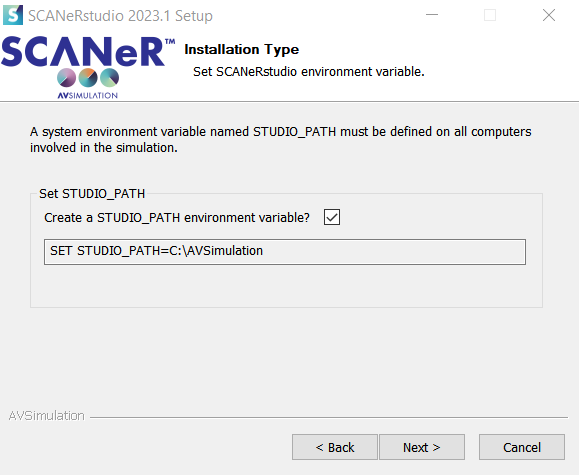
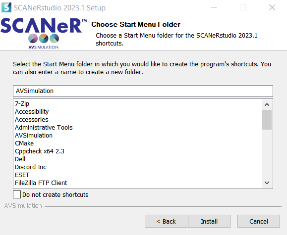
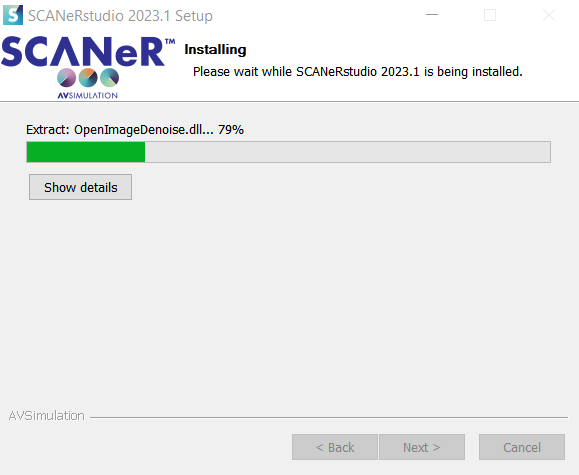
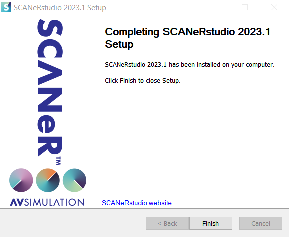

# How to install SCANeR

This guide will walk you through the installation process for SCANeR.

## Pre-requisites

If you don't have a *SCANeR studio installer* yet, check out [Download the evaluation version of SCANeR](../HT_Download_Trial_SCANeR/HT_Download_Trial_SCANeR.md).

The installation of SCANeR requires full administrator privileges.

## Install SCANeR

* Unzip SCANeR archive ```SCANeRstudio-2022.1rXX_Trial.zip ``` 

* Launch SCANeR installer ```SCANeRstudio-2022.1rXX_Trial.exe ```



* Click ```Next```


* Click ```I Agree```



* Leave all components selected

> **Info:** Items include simulation data, configuration files, APIs samples and dependencies for the licensing system, sound and video management.

* Click ```Next```



* Choose the installation folder

> **Note:** We recommend installing SCANeR studio on a different disk than the operating system (e.g. ```D:``` instead of ```C:```).

* Click ```Next```



* Sharing the installation folder is required for a multi-computer configuration.

> **Info:**  SCANeR can utilize a multi-machine configuration on any architecture (workstation, simulator, HiL, Cloud) as long as all nodes (PC or VM) are on the same local network.

* Click ```Next```



> The environment variable is required for SCANeR studio to work.

* Check the box ```Create a STUDIO_PATH environment variable```

* Click ```Next```



* Click ```Next```



* Wait for the completion of the installation

* Click ```Install```



> Installation is finished

* Cick ```Finish```

Congratulations, SCANeR is now installed and ready to run!

<iframe width="560" height="315" src="https://www.youtube.com/embed/joE1Fi09eEY?start=49" title="YouTube video player" frameborder="0" allow="accelerometer; autoplay; clipboard-write; encrypted-media; gyroscope; picture-in-picture" allowfullscreen></iframe>

## License

The SCANeR Trial installer includes an automatic 45 day license.
