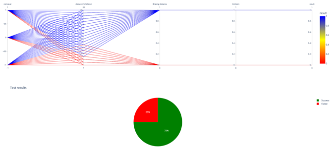

# Guide 5. How to analyse all my results

Once the simulations have been executed, you’ll get all test cases results (60 in our case).  
To analyze case by case scenario SCANeR’s users can use SCANeR studio standard “dashboard” (Analyzing Tools for familiar users 😉).  
It enables to trace synchronized graphs, camera views, sounds, export to CSV, etc.  
To process Big Data a traditional “dashboard” is not enough. You’ll need apps giving you a point-&-click interface to expand the possibilities.  
As any user, test case, IT infrastructure are unique we offer the possibility to deploy and scale SCANeR results within your favorite apps, so scientists and engineers can put complex analytics in the hands of business decision makers and operators.  
For this SCANeR application we display SCANeR results within point-&-click web interface to models written in Python.  

> Tips, a standard installation of Python is required, it uses specific libraries as: dash, plotly, pandas.



## How to use it?

We deliver with this sample the 60 SCANeR results, so you just have to enjoy the view 😊

* Double click on `.\bin\x64\analytics\AEB\resultsAnalysis.bat`  

Principle: it generates a csv file next to him named `results.csv`, it fills it thanks to SCANeR standard results available in `.\bin\x64\analytics\AEB\results`. It launches the point-&-click web interface and, load and display the results.

> Tips,
> * If necessary do not hesitate to refresh the web interface.
> * The web server is by default on [http://127.0.0.1:8050](http://127.0.0.1:8050)

## How to make your own?

* Open in your favorite text editor `resultsAnalysis.bat`
* Line 2, set the arguments of `get_results.py` to use your data

```C
python get_results.py <path of DoE  file> <path of SCANeR results’ folder>
```

E.g.
```C
python get_results.py ".\EVAL_ADAS_CTRL\Design of Experiment 1\testcases.xtc" results
```
