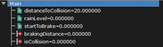
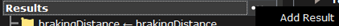
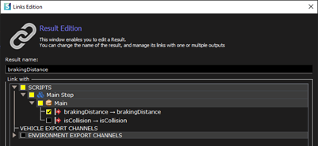
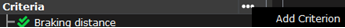
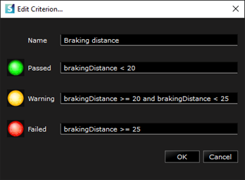
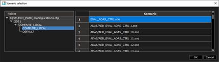
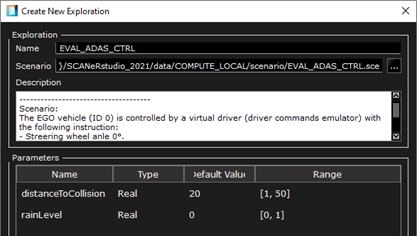
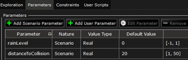
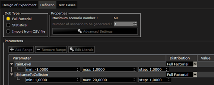
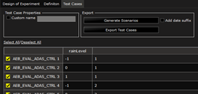

# Generate known and unknown test cases

For Massive Simulation applications you will need a list of scenarios to test and validate your systems in known and unknown situations.  
Thanks to SCANeR studio you can prepare template scenarios with parameters, criteria for success, failures and so on.  
These will enable you to automatically generate known and unknown scenarios and measure their performance.  

In this guide you’ll see how to
- Step 1.	Define template scenario parameters and criteria
- Step 2.	Design a test plan to vary parameters and generate N scenarios

> This guide assumes you’re familiar with SCANeR scenario basics.  
>  :leftwards_arrow_with_hook: [Create a scenario based on your road network](../HT_Create_your_first_test_case/HT_Create_your_first_test_case.md)

## Step 1. Define template scenario parameters and criteria

> * A **parameter** can change in order to create *variability* when generating several versions of a same template scenario.
> * A **criteria** is a *test* during the simulation to know afterwards what scenario variation succeeded or failed.

When creating a scenario for Massive Simulation it is necessary to make it versatile.  
To do so we will use script variables. A variable can be an Input, Output or Internal  
In Step 2 we will vary 2 scenario parameters: `distanceToCollision` and `rainLevel` 

For this reason, we will focus mostly on those during Step 1.  
Regarding criteria, it is mandatory to use Output variables.  
An Output variable makes its content accessible to setup a criteria (e.g. if this Output variable is equal to 1 then it is a success, otherwise it is a failure).
> `Script Output` > `Scenario Result` > `Scenario Criteria`

In the delivered template scenario `EVAL_ADAS_CTRL.sce`, we provide:
* 3 Internal variables (`distanceToCollision`, `rainLevel` and `startToBrake`)
* 2 Output variables (`brakingDistance` and `isCollision`)

Regarding scenario parameters, we are all set.  
We’ll make those vary within the Step 2.  
To finish the Step 1 let’s see how to setup the criteria!  
First add a result  

Select the Output variable you would like to use for your criteria and give it a name.  
In our case we select the Output variable `brakingDistance` and name its result `brakingDistance` (great inspiration 😅).

Repeat this step as many times you need.  
In our case we’ve defined 2 results: `brakingDistance` and `isCollision`  
Now let’s see how to design or criteria from these results 🤔  
Add a new criterion  

Once created, edit it by double clicking on it and then set its levels  

Repeat this step as many times you need.  
In our case we’ve defined 2 criteria: `Braking distance` and `Collision`  

## Step 2. Design a test plan to vary parameters and generate X scenarios

To do so we’ll have to use SCANeR explore.  
There is a different way to move from studio to explore, this is my favorite: from studio click on menu `TOOLS` and select `SCANeRexplore – test purpose tool`.  
SCANeR explore will open. 

In this step we’ll see how to design a basic test plan to make our scenario parameters vary and generate known and unknown scenarios.  

1. Create a new test plan: go to menu `FILE\New…` and select `Empty Test Plan`

2. Give a name to your test plan and select your SCANeR workspace (configuration: `SAMPLE_COMPUTE_LOCAL` in our case)

3. Now that the test plan is created let’s create an `Exploration` (a test plan may have several Exporations): Select the SCANeR workspace you want, `SAMPLE_COMPUTE_LOCAL` in our case, and the desired scenario, `EVAL_ADAS_CTRL.sce` in our case. You’ll have an overview of the scenario content and its available Output variables. You can add/edit as many parameters, constraints, etc. as you want. Once ready let’s Design the Experiment!

> Tip: Output variables are automatically defined as varying parameters. Nevertheless, you can add other varying parameters manually. 😉

In our case we use

4. Select Design of Experiments and click on Add Design of Experiments. From the Definition you’ll be able to set up the type of experiment.

> Tips,
> * Full Factorial: operates a cartesian product between parameter values to generate draws.
> * Statistical: operates a statistical law to the parameter values to generate draws.
> * CSV: imports Draws.

In our case we use

This set up leads us to generate 60 scenarios. 
Once ready, click on Generate to preview the scenarios.  
You can pre-visualize the 60 scenarios that you’ll be able to generate (if you want).  

> Tip: at this step the scenarios are not “physically” generated. You can decide the generate them, edit their name etc. by selecting/deselecting them.

In our case we use

5. Once satisfied simply click on `Generate Scenarios`. The scenario files will be produced,  and you’ll be invited to select a repository to host them.

Congratulations! You now have your known and unknown scenarios to test and validate your systems.  
We now have to run these! How? There are 3 methods:
* On a local machine, as a parametric exploration, from explore GUI, click on `Execute selected test cases`. This action will call SCANeR compute, and scenarios will be executed in sequence.
* On a simulator, using SCANeR studio, all the produced scenarios are compatible. However, such a process is usually used to test and validate systems Massively, so we would prefer to use SCANeR compute.
* On HPC/Cloud, SCANeR compute! Here is the one we were looking for and we’ll detail it in the next guide. SCANeR compute is the SCANeR studio solver, it enables you to run SCANeR simulation on HPC architecture. You’ll be able to handle it within your favorite IT architecture. It is compatible with any HPC platform (e.g. Azure, AWS, Alibaba) and supports any container solution (e.g. Docker, Kubernetes). You’ll be able to run it in parallel for Massive Simulation applications, design your job scheduling, etc.

