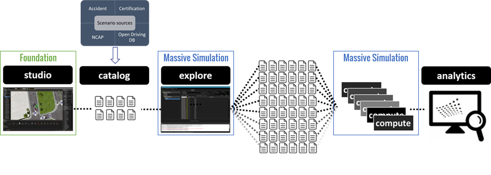

# How to? run a massive simulation to test and validate an ADAS

This Quick Starts will guide you to
* Step 1. Prepare SCANeR workspace under Windows
* Step 2. Generate test cases thanks to SCANeR studio, explore under Windows
* Step 3. Port SCANeR workspace under Linux
* Step 4. Run test cases thanks to SCANeR compute under Linux
* Step 5. SCANeR Analytics

It requires
* [Foundation Pack](https://www.avsimulation.com/pack-foundation/)
* [AD/ADAS Pack](https://www.avsimulation.com/pack-ad-adas/)
* [Massive Simulation Pack](https://www.avsimulation.com/pack-massive-simulation/)

You don't have these already? [Get your Trial version of SCANeR](https://www.avsimulation.com/free-download/).

> Tips, If you do not have yet all of the above content no worries 😉  
> You can download and use our prepared one: [AEB test case]()  
> This is the data we'll use in steps below :thumbsup:

## Principle of operations

SCANeR compute is SCANeR studio solver, it enables to run SCANeR simulation on HPC architecture.  
It is compatible with any HPC platform (e.g. Azure, AWS, Alibaba) and supports any container solutions (e.g. Docker, Kubernetes).  
To generate known and unknow test cases use SCANeR explore (it takes as an input a SCANeR studio test case).

:arrow_right: [Follow the Guide 1: Prepare SCANeR workspace under Windows](HT_Prepare_SCANeR_workspace_under_Windows.md)
