# Port SCANeR a workspace in Linux

The SCANeR workspace we made up to now is for Windows (`SAMPLE_COMPUTE_LOCAL`).  
Using an HPC architecture with a Linux distribution requires porting the Windows SCANeR workspace to Linux.  
The goal of this guide is to explain this procedure

- Step 1.	Install SCANeR in Linux using the Standalone method
- Step 2.	Port the Windows SCANeR workspace to Linux
- Step 3.	Compile your system under test in Linux

## Step 1. Install SCANeR in Linux using the Standalone method

Two kinds of Linux installations are available:
* Hybrid: supervise SCANeR simulation from Windows and distribute SCANeR execution on Linux and/or Windows. It comes as a Windows Add-on installer.
* Standalone: runtime method, to run SCANeR studio or compute without server X11. Used to distribute SCANeR on HPC/Cloud, and it supports container solutions (e.g. Docker, Kubernetes).

For Massive Simulation applications we’ll use the Standalone method.  
To install SCANeR in Standalone mode you’ll need the Standalone package: `SCANeRstudio_202X.X-rXX.tar.bz2`  

> AVS customers will find the Linux Standalone installer on the [Support Website](https://support.avsimulation.fr/en/).  
> If you don't have it just ask us 😊  

Extract the contents of the tar archive and follow the steps in the  [`README-202X.Linux`](./assets/README-2022.Linux)

> Note: it is available under: `.\SCANeRstudio_202X.X-rX.tar.bz2\SCANeRstudio_202X.X-rX.tar\AVSimulation\`

In this README you’ll learn:
* How to do a SCANeR installation in Linux
* SCANeR dependencies you’ll need to install
* SCANeR license installation and setup
* How to execute SCANeR under Linux
* How to compile the SCANeR SDK in Linux
* How to use SCANeR in headless mode

## Step 2. Port the Windows SCANeR workspace to Linux

Once the installation of SCANeR in Linux is finished, you have to make your SCANeR Windows workspace accessible.  
As each IT infrastructure is different there is no specific method, choose your favorite one.  

In our case we’ll simply share the Windows drive with Linux and copy/paste the Windows SCANeR workspace in Linux before customizing it.  
We use Ubuntu 20.04 LTS x64.  
In our case we

1. Copy/paste the content of Windows SCANeR workspace to Linux SCANeR workspace (`SAMPLE_COMPUTE_LOCAL`).

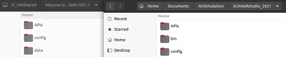

To avoid confusion we'll rename the `SAMPLE_COMPUTE_LOCAL` to `SAMPLE_COMPUTE_HPC` under:
* `.\APIs`: contains your system under test interface
* `.\config`: contains your SCANeR environment
* `.\data`: contains your SCANeR assets

> Tip: Both SCANeR workspaces are identical in terms of environment and assets. However as the OS are different each has specificities:
> `SAMPLE_COMPUTE_LOCAL`: paths to SCANeR Windows processes, cpp project's file setup for Windows, SUT built and delivered for Windows.
> `SAMPLE_COMPUTE_HPC`: paths to SCANeR Ubuntu processes, cpp project's file setup for Ubuntu, SUT built and delivered for Ubuntu.

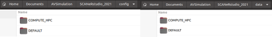

2. We add its name and path to `configurations.cfg`

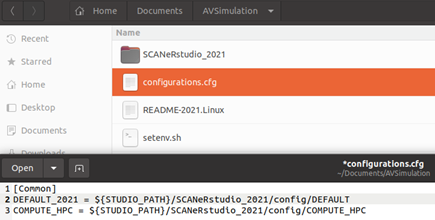

3. Let’s edit our new SCANeR workspace `SAMPLE_COMPUTE_HPC` in Linux and update SCANeR process paths: call `SCANeRconfigurator` from your shell 

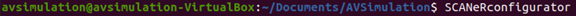

It gives you access to the SCANeRconfigurator HMI

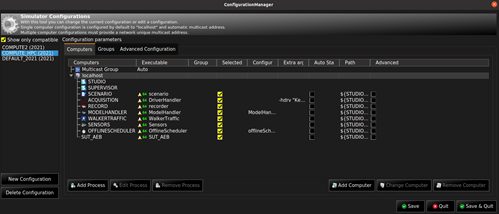

For each SCANeR module available in your SCANeR workspace, update its executable path:  
In `SAMPLE_COMPUTE_LOCAL` you had  

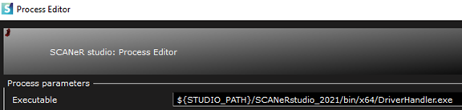

Update it to `SAMPLE_COMPUTE_HPC` to  

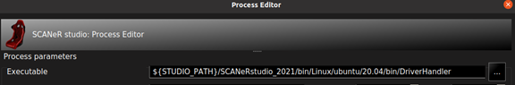

Repeat for all your SCANeR modules 👍🏻

> Note: do not forget to setup your shell environment for SCANeR by calling the SCANeR setenv (more details are available in the `README-202X.Linux`)
> 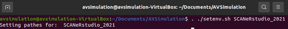

## Step 3. Compile your system under test in Linux

> Tip: The SCANeR SDK is the same between Windows and Linux. So? That’s good news, as you do not have to modify your existing System Under Test’s software interface with SCANeR, you simply have to rebuild it 👍🏻

In our case the sample we deliver is under: `.\APIs\samples\ScanerAPI\SUT_AEB`

> Note: all details you need to build up your system under Linux are available into `README-202X.Linux`

Your system under test is now ready to build in Linux!  
To compile it, go to `SCANeRstudio_202X/APIs` and execute  
```C
cmake .
```  

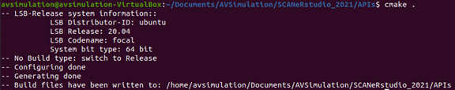

```C
make
```  

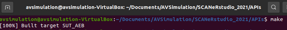

The default output of the executable is under `.\data\<your_workspace>\bin\<distribution>\<version>\`  
In our case `<your_workspace>` is SAMPLE_COMPUTE_HPC, `<distribution>` is ubuntu, and `<version>` is 20.04.  

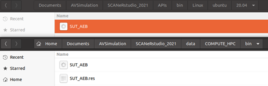

> Tip: this architecture is a generic one. As each IT infrastructure is different you can of course decide to implement it another way 😉 if you have any questions please feel free to ask us! Putting the system under test in the SCANeR workspace is convenient for later applications such as when running SCANeR in a container. But we'll see that later.  

> Tip: to add a project to the compilation list simply:
> 1. Edit `.\APIs\samples\ScanerAPI\CMakeLists.txt` and add the line
> ```C
> ADD_SUBDIRECTORY(<your_project_name>)
> ```
> `<your_project_name>` is `SUT_AEB` in our case  
> 2. Create a new CMake file in your project `.\APIs\samples\ScanerAPI\SUT_AEB\CMakeLists.txt` and add the following lines  
> ```C
> SET(TARGET_NAME “SUT_AEB”)  
> ADD_EXECUTABLE(${TARGET_NAME}  
> <your_c_file.cpp>  
> )  
> TARGET_LINK_LIBRARIES(${TARGET_NAME}  
> ${SCANeR_API_LIB})  
> ```
> `<your_c_file.cpp>` is `sut_aeb.cpp` in our case

After these steps, you can make sure that you’re all set by editing `SCANeRconfigurator`.  
You should have the following result if you use the configuration we deliver.  

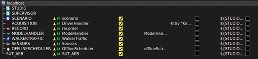
