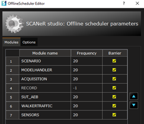
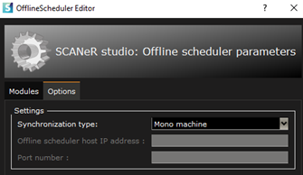
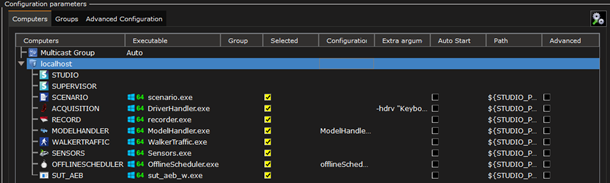
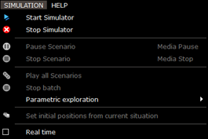

:arrow_left: [Home of Massive Simulation](HT_Massive_Simulation.md)

# Guide 1. How to prepare a workspace for Massive Simulation under Windows

To run SCANeR on an HPC/Cloud architecture (or within container solutions as Docker, Kubernetes, etc.) you need to customize the SCANeR workspace in order to prepare it to run without server X11 (i.e. without graphical interface).

Good news we have all you need 👍🏻

You simply need to configure your SCANeR environment to fit your needs and IT infrastructure. 

In this guide you will see
- Step 1.	Setup essentials SCANeR modules for Massive Simulation
- Step 2.	Activate non-real-time simulation

## Step 1. Setup essentials SCANeR modules for Massive Simulation

This guide assumes you know how to create and manage basis of a SCANeR workspace.  
:arrow_right: [How to create a new workspace](../HT_Create_A_New_Workspace/HT_Create_A_New_Workspace.md)
In our case we create a SCANeR workspace named `SAMPLE_COMPUTE_LOCAL`  

The essentials modules are the ones using X11 server as
* SCANeR `VISUAL` or `URENDERER`: driver view
* SCANeR `ACQUISITION`: cockpit commands
* SCANeR `OFFLINESCHEDULER`: simulation orchestrator

### SCANeR `VISUAL` or `URENDERER`: driver view
To run SCANeR without X11 server you need to remove SCANeR modules which require X11 server as: `VISUAL`, `URENDERER`  
Depending of your test case you’ll need to add essentials SCANeR modules as:
* AD/ADAS: `SENSORS`, `LASERMETER`, `CAMERASENSOR`, `GPSSENSOR`, etc.
* Headlights: `NIGHTTESTMANAGER`, `AFSMANAGER`, etc.
* Etc.

In this guide we’ll use an AD/ADAS test case, let’s add a `SENSORS` module to `SAMPLE_COMPUTE_LOCAL` workspace (we’ll use it to control a radar).  
> **Tips:** `SENSORS` module supports as many functional sensors as the CPU/GPU is able to process.  
> These sensors are: radars, logical cameras (generates logical information, not images), lighting sensors, E-Horizon and ultra-sonic sensors.  

### SCANeR `ACQUISITION`: cockpit commands

SCANeR `ACQUISITION` module is available in two modes with or without GUI.  
Let’s make sure than that it is set in non-GUI mode.  
To do so edit the `ACQUISITION` module and make sure that the following both options are checked: hide window, start without GUI (no X)  

### SCANeR 'OFFLINESCHEDULER': simulation orchestrator

The `OFFLINESCHEDULER` is an orchestrator, it enables to control SCANeR modules’ execution step by step.  
Edit its settings and make sure that the step period and the synchronization is fine.  
In our case the step period is 50 ms (1/20)  

The synchronization method is 

Your SCANeR workspace `SAMPLE_COMPUTE_LOCAL` should now looks like this

> Note, the `SUT_AEB` module is a custom program we made thanks to SCANeR SDK.  
> We use it as a gateway between SCANeR and the system under test, an AEB in this case.  
> Want to learn more about How to evaluate and validate an ADAS? [Click here](../HT_ADAS/HT_ADAS.md)  

## Step 2. Activate non-real-time simulation

This step is easy and fast!  
In order to inform SCANeR environment that the orchestrator is the `OFFLINESCHEDULER` we need to disable the Real time mode.  
To do so, from the main GUI of SCANeR studio, click on menu `SIMULATION` and uncheck `Real time` option.

You’re SCANeR workspace is now all set!

:arrow_right: [Follow the Guide 2: Generate test cases thanks to SCANeR explore under Windows](HT_Generate_test_cases.md)
