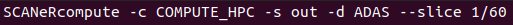
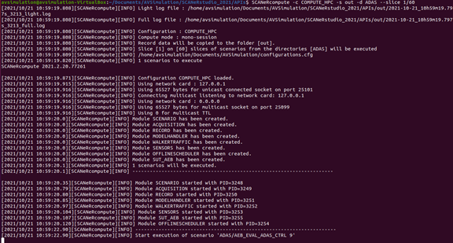
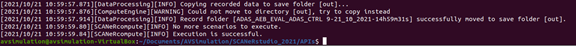

# Guide 4. How to validate the new SCANeR workspace for Linux before to run it on HPC

Perform local test enables you to make sure that you did not miss anything before to run Massive Simulation.  
It’s easy, simply run your test cases with SCANeR compute. To do so run  

We add the `--slice` argument to run only 1 test case, if one is running then that means that our SCANeR workspace is set up.  
Here is the results you should get:  

...  

Getting this result: `Execution is successful` means that you did a great job and you’re now ready for Massive Simulation!  

To run SCANeR compute on HPC architecture for Massive Simulation application it is exactly the same way 😊  

Here is a list of the remaining actions on your side, we offer services on demand to assist you into the deployment of SCANeR:
* SCANeR data have to be accessible on the machine where SCANeR compute is executed.
* System Under Test (SUT) as a Model in the Loop have to be accessible on the machine where SCANeR compute is executed.
* Organize, format and made results available to end-user(s). See next (and last) guide for SCANeR Analytics demo
* Manage jobs scheduling in cloud environment(s).

SCANeR Standalone method supports any container solutions (e.g. Docker, Kubernetes).
Ask us for details 😉
