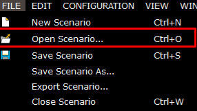
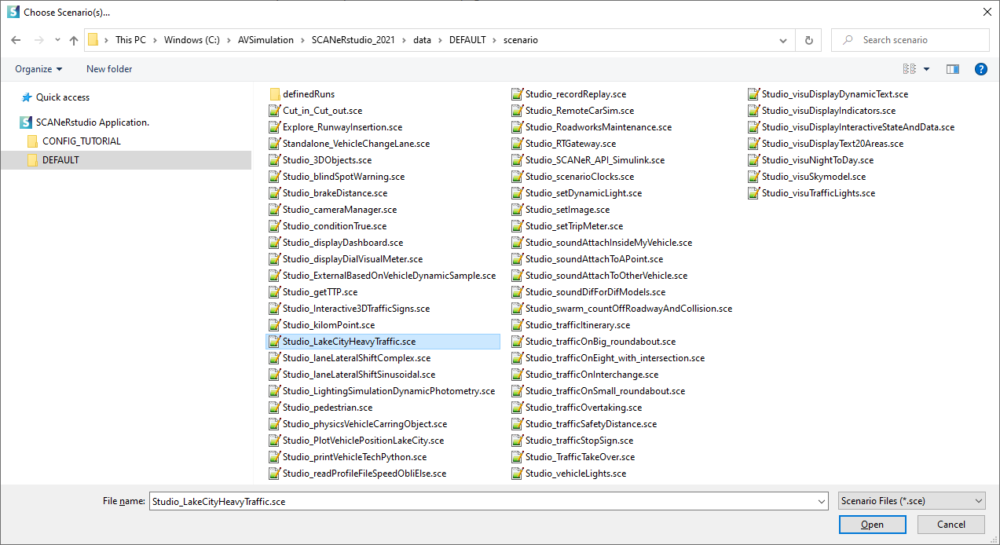
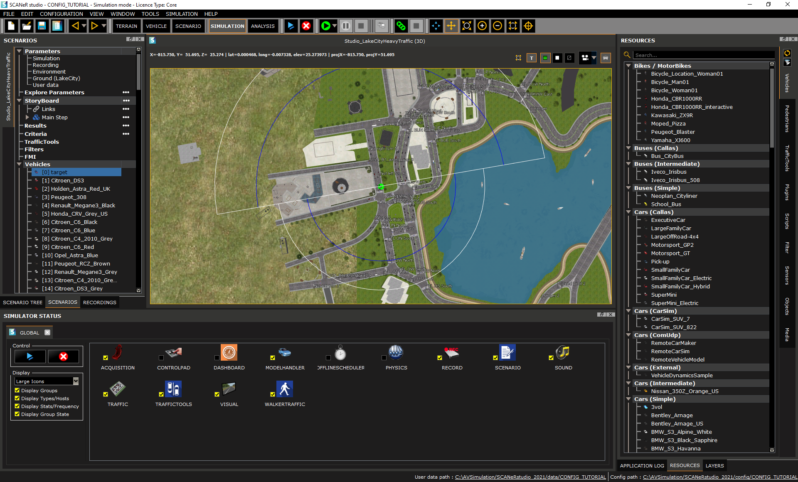
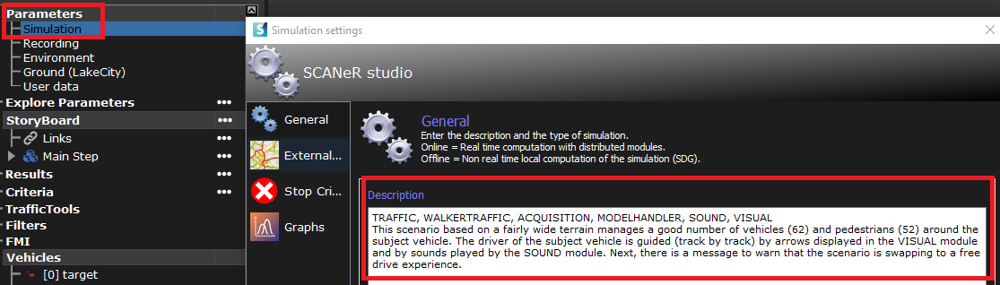

# How to open an existing scenario

Are you looking for pre-built scenarios for your test case? Or trying to learn more about SCANeR features?

This guide will explain how to find and open a delivered scenario
- Step 1. Access the DEFAULT scenarios
- Step 2. Open your preferred scenario

## Step 1. Access the DEFAULT scenarios

Click on `FILE\Open Scenario...` in the menu

## Step 2. Open your preferred scenario

Select the `Studio_LakeCityHeavyTraffic` scenario and click on `OK`

>Tip: if you cannot see the DEFAULT folder in the in the file tree, uncolpase the `SCANeRstudio Application` tree 😉.

You'll get the following result 😊

You're all set and ready to run your first simulation 👍🏻

>Tip: to have a quick overview of the scenario storyboard and required modules, you can edit the 'Simulation' parameter by double clicking on it. You'll get the following information  
> 
