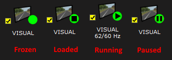
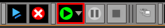

# How to? Run a SCANeR simulation, the good practices

You are using SCANeR everyday to manage your experimentation but do you use it in the proper way ? 🤔

This guide explains how to manage the execution of your simulation
- Step 1. Prepare the configuration
- Step 2. Run modules
- Step 3. Run the simulation
- Step 4. Stop the simulation
- Step 5. Stop modules 

## Step 1. Prepare the configuration

1. Open SCANeR studio on your system and go to `CONFIGURATION\Configuration Manager...`

2. Tick (or untick) the `Selected` field next to each modules.

This field allows you to quickly launch several modules. (needed for the Step 2.)  
>The field `Auto Start` can launch automaticly your module. 

Modules can be checked directly on `Simulator Status` but the state is not saved. 

## Step 2. Run modules

1. Click on the `Start Simulator` button (double blue triangles) to launch all the previously selected modules
  

2. Verify the status of the modules thanks to symbol in the green circle next to the modules.  
  
The correct status of the module should be `Loaded`  

>Would you like to create your own module, and learn more about their states? [How to? API creation]()

## Step 3. Run the simulation
Click on the `Play Scenario` button (black triangle in a green circle) to launch the simulation  
  
The correct status of the module should be `Running`  

>If you have set parameters in your scenario you can set the value of these parameters at the start of the simulation. Click on the grey triangle next to the `Play Scenario` button and choose `Play Scenario with Parameters`. Would you like to design parametric simulation? [How to? Design scenario for SCANeR Explore]()

## Step 4. Stop the simulation
Click on the `Stop Simulation` button (black square in a red circle)  

⚠ This is the right way to stop the simulation, any others button should be used to stop the simulation. ⚠  
Pause the simulation is also possible, click on the `Pause Simulation` button while while the simulation is running 😊

## Step 5. Stop modules
Click on the `Stop Simulator` button (white cross in a red circle)  

This button close, and kill the SCANeR modules in a clean way. If you stop the simulation with this button inconsistencies can appear (e.g. at the reload of the next simulation).  
  
We rely on you to run your simulation as it should be 😉
