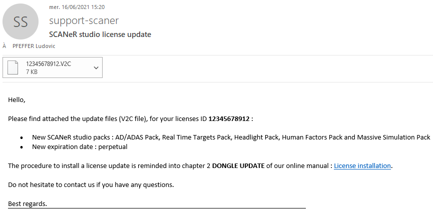
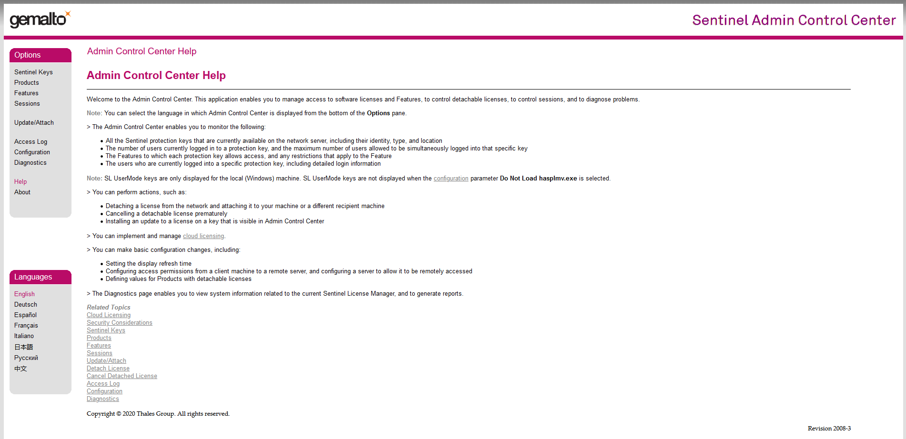
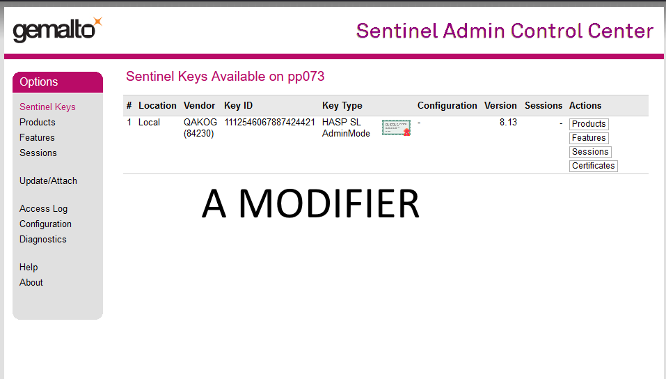
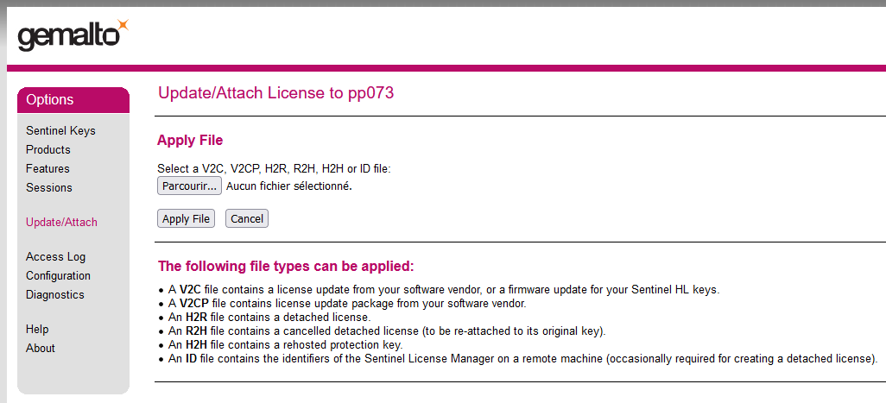

:arrow_left: [How to install your SCANeR license](../HT_Install_SCANeR_license/Install_SCANeR_license.md)

# How to? Update your SCANeR license

You already have a SCANeR license and you have purchased new packs, or a modification on your license has been recommended. 

This guide explains how to update your SCANeR license
- Step 1. Receive the new update license
- Step 2. Open the web service / Sentinel Admin Control Center(SACC)
- Step 3. Apply the update to your license
- Having troubles

>**Important notes:**  
>Updates are incremental, so you must apply each delivered ones.  
>The license update procedure is the same for a Nomadic or a Fixed license.  
>If you install a license update on a machine where SCANeR is installed an internet connection is not required, otherwise it is.  
>For Nomadic license only: We recommend to apply a dongle update on a machine where SCANeR is installed. If you need to apply a license update from a computer where SCANeR is not installed then you must first make sure that the license’s driver is installed. To do so, try to access to the [SACC](http://localhost:1947) on the machine. If you cannot access to the SACC then the dongle’s driver must be installed on the machine before to start (administrator privileges are required).  
>For Fixed license only: The dongle update procedure must be followed on the software licenses’ server where the software license has been installed.  

## Step 1. Receive the new update license 

1. Open your favorite mail service, you should receive an email from [support-scaner](mailto:support-scaner@avsimulation.fr)

2. Download the `V2C` file attached to this mail, and save it on your computer.
First step is done, pretty easy 👍
>**Note:**
>`V2C` means Vendor To Client. On the other hand, `C2V` means Client To Vendor. 

## Step 2. Open the web service (SACC) 

1. Open your favorite internet browser, and write the following address: [http://localhost:1947](http://localhost:1947). You should be on the license service: Sentinel Admin Control Center

This webpage is where you can manage SCANeR license, you can visualize which licenses are recognized by your computer and if they are used.

2. If your license is a Nomadic one, plug the USB dongle in your computer. You can check if your dongle is plugged by clicking on `Sentinel Keys`, or [here](http://localhost:1947/_int_/devices.html).

>If you have several dongle plugged in your computer, you can make them blink to identify which is which 🤩. To do so, click on the `Blink On` button

3.  Click on `Update/Attach`, you'll be redirected on the following [page](http://localhost:1947/_int_/checkin.html):

## Step 3. Apply the update to your license

1. Click on `Browse` button, and selected the previously saved V2C file.
2. Then click on `Apply File`

Congratulations! 💪  
Your license is now updated, you can ejoy your new SCANeR products ! 😊

:arrow_right: [Start using SCANeR studio](../HT_FirstLaunch/HT_FirstLaunch.md)
