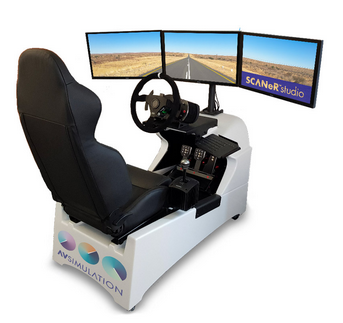

# How to configure the visual rendering

SCANeR is able to render the simulated scene on any projection system, including single or multi-screen displays, projector(s) with or without warping/blending or head-mounted displays (VR), flat or curved monitors, etc.

This guide helps you configure the visual rendering for your display system.

* Important considerations
* Step 1. Add a new visual module
* Step 2. Initiate the configuration
* Step 3. View geometry
* Step 4. Quality VS performance
* Go further (advanced guide)

## Rendering engines

In SCANeR it is possible to render using the **Open Scene Graph** and/or **Unreal** rendering engines.
The current guide is based on SCANeR's **Open Scene Graph** visual.
SCANeR visual is defined by one instance of the *Visual.exe* executable which is commonly named the VISUAL module.
> 1 VISUAL module runs on one graphic processing unit (GPU).
> 1 VISUAL module can be split into multiple channels so with 1 GPU you can have multiple displays ([as with our SimEASY Driving Simulator for example](https://www.avsimulation.com/simulators/simeasy/)
> 1 visual license is included with the [Foundation Pack](https://www.avsimulation.com/pack-foundation/). We can add as many visual licenses as you need, just ask us 😉



## Step 1. Add a new visual module

The visual rendering of the simulation is managed by the module "Visual.exe", usually called "VISUAL" when creating a new [SCANeR workspace](../HT_Create_custom_work_environment/HT_Create_A_New_Workspace.html).

In order to have your own visual module configuration, start by [adding a new visual module in your configuration](../HT_Add_module/Add_module.md)*.
* The *executable* of the module should be `${STUDIO_PATH}/SCANeRstudio_2021/bin/x64/visual.exe`
* The *process name* of the module is your choice.
  We recommend capitalized names without white space.
  For clarity, start with "VISUAL_" followed by the name of your simulator, work station or display system.
* The *configuration file* can be any text file. We recommand using the default name `observer.cfg`, or at least one that starts with `observer...`.
> **Tip:** In the *Process Editor*, click *VISUAL* in the list of SCANeR modules in order to generate the default the process parameters. Then adjust to your liking.


## Step 2. Initiate the visual configuration

In the *Process Editor*, click the file icon  in front of the configuration file in order to open and edit it.

> **Note:** If you are using a new file, start by copy-pasting the contents from `SCANeRstudio_2021/data/DEFAULT/observer.cfg`.

The file is divided in sections.
```
[Common]
; settings that will be applied to all visual modules using that use this configuration file.

[VISUAL]
; settings that will be applied to the visual module called "VISUAL"
[VISUAL:1]
; settings that will be applied to pipe #1 of "VISUAL"
[VISUAL:1.1]
; settings that will be applied to the channel #1 of pipe #1 of "VISUAL"

; [...]
```

Unless a setting is defined in a lower hierarchy level, the value is inherited from higher level of hierarchy.  
`[Common]` > `[VISUAL]` > `[VISUAL:1]` > `[VISUAL:1.1]`

Below the existing sections, create new sections that match your own visual module name.
```
; [...]

[VISUAL_SHOWSIM]
NbPipes			= 1
VehicleId		= 0

[VISUAL_SHOWSIM:1]
NbChannels		= 1

[VISUAL_SHOWSIM:1.1]

; [...]
```
Here the first settings are added:
* *NbPipes = 1*: There is only one visual pipe.
* *VehicleId = 0*: The view will track the "ego" vehicle (of ID 0)
* *NbChannels = 1*: There is only one channel in the first pipe.

> Note: the name of a section is case sensitive with the name of the visual into your SCANeR workspace.

## Step 3. View geometry

### On screen rectangle

The *Visual Pipe* draws the window on screen. By default, it is a borderless rectangle. The rectangle geometry is set by two parameters:
* *Position*: The coordinates of the *bottom left* corner in pixels, from the *bottom left* corner of the screen.
* *Resolution*: The size in pixels.

So in order to cover a Full HD display, use the following settings:
```
[VISUAL_SHOWSIM:1]
Position    = 0 0
Resolution  = 1920 1080
;[...]
```

### Field of view (FOV)

The *Visual Channel* describes the field of view by the screen geometry relative to the eye:
* *ScreenDist*: The distance between the human driver's eye and the display.
* *ScreenTop*, *ScreenBottom*, *ScreenLeft*, *ScreenRight*: The display border positions relative to the projection of human driver's eye on the display.


In principle the settings values should be the result of measurement on the actual displays, or from the simulator's CAD.

1. Define the horizontal FOV from measurements or CAD.
2. Compute the vertical FOV to apply.

Doing so ensures that the aspect ratio of the screen (e.g. 16:9) is respected.

Example measurements:
* Screen distance is measured at 2.0 meters
* Horizontal FOV is measured at 30 degrees

Computations:
* ScreenLeft = `tan( FOV ) / ScreenDist` = `tan( 30 ) / 2.0` = `0.28868`
* ScreenTop = `tan( FOV ) / ScreenDist / ScreenRatio` = `tan( 30 ) / 2.0 / (16:9)` = `0.16238`

```
[VISUAL_SHOWSIM:1.1]
ScreenDist    = 2.0
ScreenTop     = 0.16238
ScreenBottom  = -0.16238
ScreenRight   = 0.28868
ScreenLeft    = -0.28868
```

## Go further

Congratulations on setting your first custom Visual!
If you want to go further and add mirrors and multi-screens, check the [Advanced visual rendering configuration guide](./HT_configure_visual_advanced.md)
