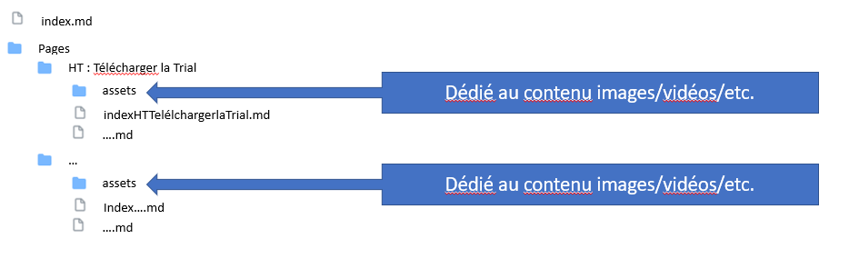

# Pages Edition Manual

## 2. First time installation

### Set up the Git local repo

* Navigate inside folder dedicated to Pages edition (e.g. D:/Pages/)
* `Right click > Git Bash here`
* In the Git Bash console, run the following commands
```
git init
git remote add origin https://github.com/AVSGuillaume/Samples-Pack.git
git fetch origin Pages
```
* When prompted, login to GitHub with the account linked to your company e-mail.
* Once fetching is finished, run the following command in the Git Bash console
```
git checkout Pages
```
This creates a new local branch "Pages" that with upstream "origin/Pages"
Now your working tree has the latest version of the Pages files.

## 3. Publish a modification

### Get the latest version from GitHub

```
git pull
```

### Start working
 
```
git status
```
```
git add Pages/HT_Something/*
```
```
git commit -m "Created or modified some page"
```

### Publish your modifications

```
git push
```

## 4. Good practices

* Follow the file tree below
* New pages go into ```(root)/Pages/(page_title).md```
* Images go into ```(root)/Pages/assets/```
* Avoid blank spaces in folder or file names, as they require '\%20' when referenced in markdown
* Reference new pages in ```(root)/index.md```


