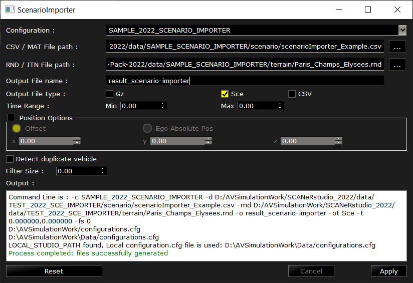

# SAMPLE_SCENARIO_IMPORTER

This is a description and user manual of the sample included in the [Samples Pack](https://github.com/AVSimulation/SCANeR-Samples-Pack).

> See also: [SAMPLE_VEHICLE_PLAYER](./VEHICLE_PLAYER.md).

Contents:
* **Goal** of the sample.
* **How to use** the sample.

## Goal

"Scenario Importer" is a feature of SCANeR that allows simulated vehicles to follow exactly recorded trajectories. 

> In the User Manual: `7.1.3.2.4.5. ScenarioImporter`.

Scenario importer uses its own data format. Data acquired from measurements or third-party software must be converted.

`🚘📈 Real world test` → `📄📄📄 Sensors recordings` (CSV, Matlab, Ibeo, ...) → **`Scenario Importer`** → `📄 SCANeR Scenario` (.sce)

The source data contains the position of one or several vehicles over time.

The positions of the Ego vehicle should be in the geodesic referential.
Other objects or vehicles position are in the cartesian referential, relative to the Ego vehicle.

This samples shows an example of formatted import data, and the process to get a scenario file from it.

## How to use

1. In SCANeR studio, load the configuration SAMPLE_2022_VEHICLE_PLAYER ([how?](../HT_Change_work_environment/HT_Change_work_environment.md)).

2. In `SIMULATION mode`, open `menu TOOLS > ScenarioImporter`.

3. Import `scenarioImporter_Example.csv`.

| Field               | Value                                                                                                            |
|---------------------|------------------------------------------------------------------------------------------------------------------|
| Configuration       | SAMPLE_2022_SCENARIO_IMPORTER                                                                                    |
| CSV / MAT File Path | .../SCANeR-Samples-Pack-2022/data/SAMPLE_SCENARIO_IMPORTER/scenario/scenarioImporter_Example.csv |
| RND / ITN File path | .../SCANeR-Samples-Pack-2022/data/SAMPLE_SCENARIO_IMPORTER/terrain/Paris_Champs_Elysees.rnd      |
| Output File name    | result_scenario-importer                                                                                         |
| Output File type    | Sce                                                                                                              |
| Time range          | Min: 0, Max: -1                                                                                                  |



4. Hit `Apply`.

   *SCANeR makes the projections and create the scenario file.*

   > The error below may appear in the log.  
   > They are the result of a known bug, but they do not prevent correct simulation.
   > ```
   > ERROR 1: Missing BASEGEODCRS / BASEGEOGCRS / GEOGCS node 
   > ERROR 1: PROJ: proj_create: unrecognized format / unknown name 
   > ERROR 6: Cannot find coordinate operations from `' to `EPSG:4326' 
   > ERROR 1: PROJ: proj_create: unrecognized format / unknown name 
   > ERROR 6: Cannot find coordinate operations from `EPSG:4326' to `' 
   > ```
   > You can ignore those.

5. Open the newly created scenario `menu File > Open Scenario > result_scenario-importer_Sce.sce`.

   *The scenario shows two vehicles. When the simulation is played, both vehicles will follow the trajectory specified in the CSV.*

### Go further

* Learn about the input format: `7.1.3.2.4.5.4. DATA FORMAT`.
* The imported vehicles are driven by Virtual Driver: `6.7.2.1.3.3. Virtual driver (automatic)`
* Use ScenarioImporter in command line: `7.1.3.2.4.5.2.1. Command line`.
