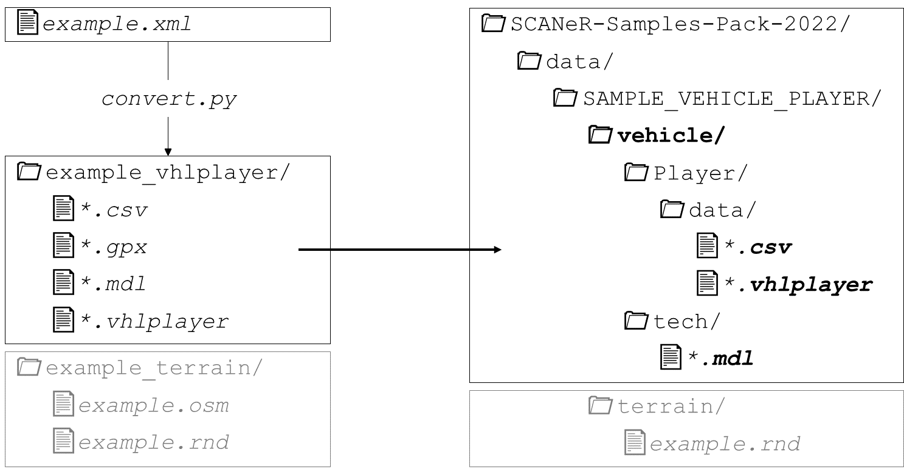
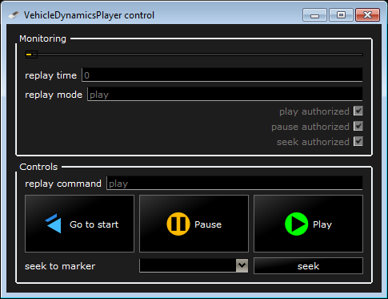

# SAMPLE_VEHICLE_PLAYER

This is a description and user manual of the sample included in the [Samples Pack](https://github.com/AVSimulation/SCANeR-Samples-Pack).

> See also: [SAMPLE_SCENARIO_IMPORTER](./SCENARIO_IMPORTER.md).

Contents:
* **Goal** of the sample.
* **How to use** the sample.
* **Explanation** to make the sample your own.
* **Go further** in case you need more.

## Goal

"Vehicle Player" is a feature of SCANeR that allows a simulated vehicle to follow exactly a recorded trajectory. 

> In the User Manual: `5.5.10. Player model`.

Vehicle Player uses its own data format. Data acquired from measurements or third-party software must be converted.

`📄 Source data file` → `📄📄📄 SCANeR Vehicle Player files`

The source data contains the position of one or several vehicles over time.

The positions should be in the cartesian referential.
Although it is possible to convert from geodesic to cartesian, as shown here.

This sample shows how to convert the source data using a Python script.
The input format is XML, but the script can be adapted to take other formats as an input.

## How to use

Pre-requisites:
* [Python 3](https://www.python.org/downloads/)
* [Pyproj 3](https://pypi.org/project/pyproj/) → `pip install pyproj`

### Step 1. Convert the vehicle trajectory data

The source data is in geodesic referential (lat, long). Let's convert it to cartesian (x, y).

1. Move to the workspace folder `SCANeR-Samples-Pack-2022\APIs\samples\VehiclePlayer\ConvertFromXML`.

   *	*The file `example.xml` contains test data exported from the third-party software PreScan.*
   *	*The script `convert.py` can read, transform and save the data in the format of Vehicle Player.*
   *	*The folder `template/` is a dependency of the script.*

2. In a console (cmd), call the script `Python convert.py example.xml`

   *Output files are in `example_vhlplayer/`.*

### Step 2. Use the vehicle trajectory data

3. Place the converted files in the SCANeR data hierarchy.

   

5. In SCANeR studio, load the configuration SAMPLE_2022_VEHICLE_PLAYER ([how?](../HT_Change_work_environment/HT_Change_work_environment.md)).

   > :point_right: Just to be sure, refresh the file index with `menu TOOLS > Update resources`.

6. Create a new scenario `menu FILE > New Scenario`

   > *Use the provided terrain `example` in the list.*

7. In the RESOURCES panel, look for the converted vehicle `hostvehicle`.

   

8. Start the simulation

   *The vehicle moves according to the input data.*

   > The error below may appear in the log.  
   > They are the result of a known bug, but they do not prevent correct simulation.
   > ```
   > ERROR 1: Missing BASEGEODCRS / BASEGEOGCRS / GEOGCS node 
   > ERROR 1: PROJ: proj_create: unrecognized format / unknown name 
   > ERROR 6: Cannot find coordinate operations from `' to `EPSG:4326' 
   > ERROR 1: PROJ: proj_create: unrecognized format / unknown name 
   > ERROR 6: Cannot find coordinate operations from `EPSG:4326' to `' 
   > ```
   > You can ignore those.

## Explanation

### Projection System

The source coordinates are in geodesic referential (lat, long). A projection allows to get them in cartesian referential (x, y).


The projection system depends on the region. In the script, the lines below must be changed according to your data location:
```python
#Projections
inProj=Proj(proj='latlong',datum='WGS84')
outProj=Proj(init='epsg:28992', towgs84='565.417,50.3319,465.552,-0.398957,0.343988,-1.8774,4.0725')
offsetX = 171338.11
offsetY = 388410.20
```

“EPSG” and “TOWGS84” codes can be found on [epsg.io](https://epsg.io/).

### Terrain

Both files under `example_terrain/` contains the road network associated to the imported data.
*	`example.osm` is the source data.
*	`example.rnd` is the SCANeR Terrain after import of `example.osm` in the Terrain editor.

## Go further

### Multiple Vehicle Player instances

It is possible to import several vehicle trajectories.
For example, if there is more than one vehicle trajectory in the input XML, the conversion script will produce several vehicle files.
Once drag & dropped into your scenario, you’ll have them in the hierarchy.


Each vehicle will need its own ACQUISITION and MODELHANDLER modules.


Finally, each vehicle instance can be linked to its dedicated modules in the Vehicle Instance Setup window.

* `Vehicle > Vehicle Process`
* `Driver > Driver Process`


### Replay GUI

The Replay GUI is a SCANeR module that helps the use of Vehicle Player.



> In the User Manual: `7.13. ReplayGUI`.
