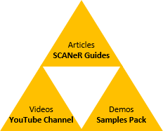

<table id="welcome">
  <tr>
    <td width="300px">
      

        
      

    </td>
    <td valign="top">
      Welcome to the SCANeR Quick Starts page. Here you will find the resources to get started with the SCANeR software: advice, best practices, tips and tricks... Follow the guide we'll accompany you step by step.  Everything described here can be done with the evaluation version of SCANeR. If you have not already done so, use the following link to request a copy: <a href="https://www.avsimulation.com/scaner-studio-trial/">Get a Trial version</a>
    </td>
  </tr>
</table>

If you want to go further with SCANeR, register for one of our online [technical events](https://www.avsimulation.com/events/). They are 45 minutes long, hosted by our engineers, cover a wide range of topics (...) and are available on our [YouTube channel](https://www.youtube.com/channel/UCYNNe9SaA3LjCFb2qXmhkoA).

Help us improve and enrich our content by sending us your feedback and adding your own contributions: [View on GitHub](https://github.com/AVSimulation/SCANeR-Quick-Starts)

## SCANeR

### Get ready

* [Download the evaluation version of SCANeR](./Pages/HT_Download_Trial_SCANeR/HT_Download_Trial_SCANeR.md)
* [Install SCANeR](./Pages/HT_Install_SCANeR_studio/HT_Install_SCANeR_studio.md)

### Get started

* [First launch](./Pages/HT_FirstLaunch/HT_FirstLaunch.md)
* [Navigate the user interface](./Pages/HT_Navigate/HT_Navigate.md)
* [Open an existing scenario](./Pages/HT_Open_a_scenario/HT_Open_a_scenario.md)
* [Run a simulation](./Pages/HT_Run_a_simulation_good_practices/HT_Run_a_simulation_good_practices.md)
* [Replay a simulation](./Pages/HT_Replay_Simulation/HT_Replay_Simulation.md)

> Tips: You've been working with SCANeR and want to know how to switch between SCANeR workspaces? Check out these links.
> 
> * [Create a new workspace](./Pages/HT_Create_custom_work_environment/HT_Create_A_New_Workspace.md) 
> * [Switch between workspaces](./Pages/HT_Change_work_environment/HT_Change_work_environment.md)

### Create your first simulation

* [Create a road network from scratch](./Pages/HT_Create_a_simple_environment_from_scratch/HT_Create_a_simple_environment_from_scratch.md)
* [Create a scenario based on your road network](./Pages/HT_Create_your_first_test_case/HT_Create_your_first_test_case.md)
* [Create a situation](./Pages/HT_Create_a_MICE_script/HT_Create_a_MICE_script.md)

### Intermediate

* [Configure the visual rendering](./Pages/HT_configure_visual/HT_configure_visual.md): adjust the setup to best fit your needs
* [Configure driver's inputs](./Pages/HT_Configure_driver_input/Configure_Driver_Input.md): select your own commands to drive
* [Define metrics](./Pages/HT_Define_and_Record_my_KPI/HOWTO_DefineAndRecordMyKPI.md): design your own Key Performance Indicators

## SCANeR Samples Pack

The Samples-Pack contains ready-to-use SCANeR configurations. Created by our engineers, it is a great source of inspiration and an opportunity to study best practices. Avoid the anxiety of a blank page and use these examples as starting points for your own projects.

> **Get the samples pack on Github: [AVSimulation/SCANeR-Samples-Pack](https://github.com/AVSimulation/SCANeR-Samples-Pack)**.

If you would like to see new demonstrations added to the Samples-Pack please contact us or [open a request on GitHub](https://github.com/AVSimulation/SCANeR-Samples-Pack/issues). We may have some scenarios that we can share, or we may take your comments into account in the next revision of the SCANeR Samples-Pack

### Get started

* [ADAS test and validation: create your test case to validate your ADAS](./Pages/HT_ADAS/HT_ADAS.md)
* [How to run a massive simulation to test and validate an ADAS](./Pages/HT_Massive_Simulation/HT_Massive_Simulation.md)
* [Headlights simulation: connect your AFS model](https://stockage.scanersimulation.com/Evaluation/2021/SCANeRstudio_EVAL_HEADLIGHTS_Tutorial.pdf)
* [Capture images from a Camera Sensor](https://stockage.scanersimulation.com/Evaluation/2021/SCANeRstudio_EVAL_CAMERACAPTURE_Manual.pdf)

## Support or Contact

Having trouble? Check out our [FAQ](http://stockage.scanersimulation.com/Evaluation/2021/SCANeRstudio_Evaluation_FAQ.pdf) or [contact support](support-scaner@avsimulation.fr) and we’ll help you sort it out.
